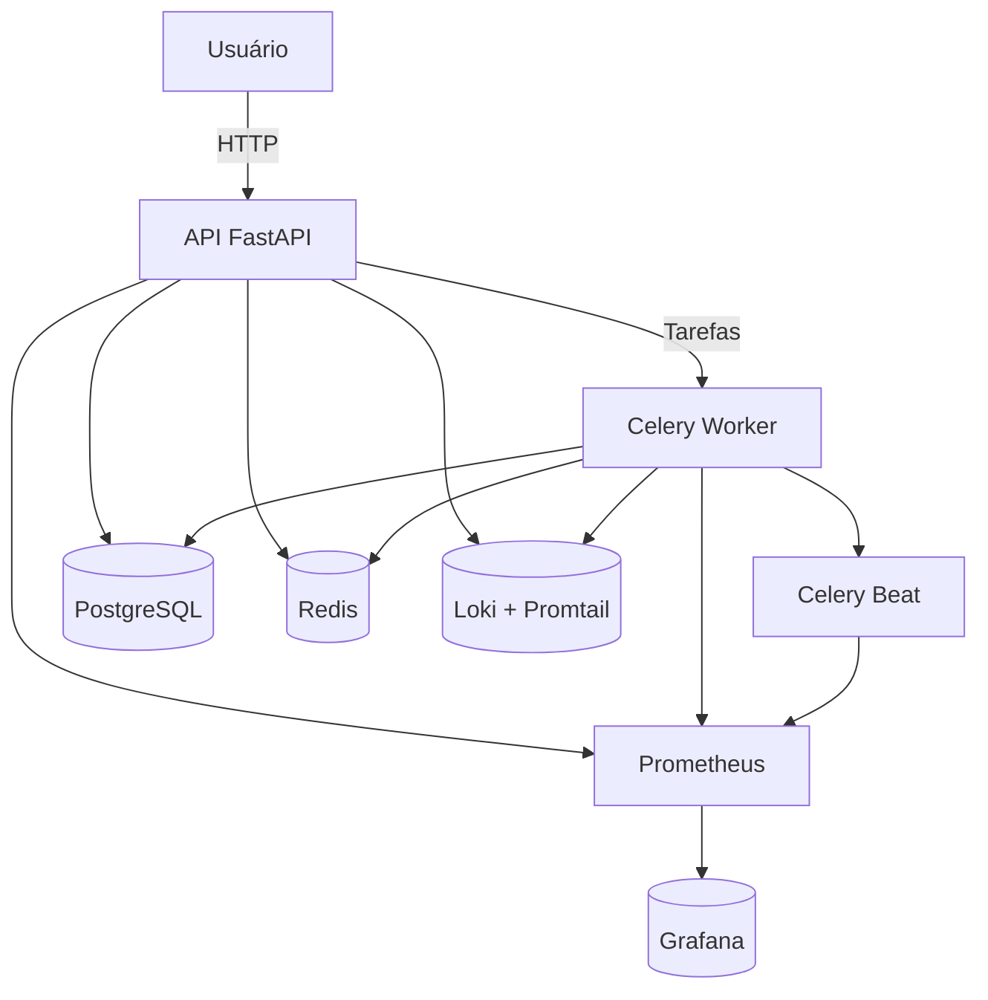
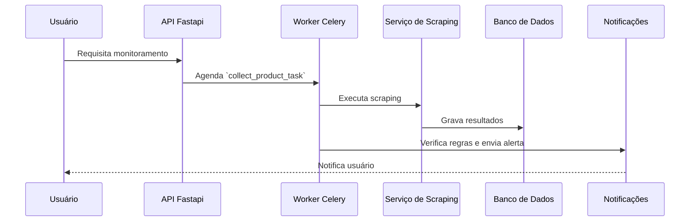

# MarketAlert
MarketAlert é um serviço de monitoramento que utiliza **FastAPI** e **Celery** para coletar dados de diferentes lojas, comparar valores e 
notificar o usuário em tempo real. A solução oferece uma API completa, workers de scraping e toda a infraestrutura de observabilidade necessária (Prometheus, Grafana, Loki e Alertmanager).


## Visão Geral da Arquitetura


O diagrama acima resume os principais componentes e como eles se comunicam. O usuário acessa a API, que registra tarefas assíncronas no Celery Worker.
O Celery Beat agenda execuções recorrentes. Dados e estados são armazenados no PostgreSQL e no Redis, enquanto métricas e logs são enviados ao stack de observabilidade.


## Como o sistema funciona
1. O usuário realiza requisições para a API via HTTP, normalmente usando um token JWT obtido no login.
2. A API registra tarefas no Celery para executar coletas de dados, comparação de preços e envio de alertas
3. O Celery Worker processa essas tarefas, persistindo informações no PostgreSQL e mantendo estados rápidos no Redis.
4. O Celery Beat agenda execuções periódicas para rechecagem de produtos e coleta de métricas.
5. Sempre que uma regra de alerta é satisfeita, o serviço de notificações dispara mensagens por email, SMS ou outros canais.
6. Métricas e logs estruturados são expostos ao Prometheus e ao Loki para acompanhamento no Grafana.


## Primeiros Passos
1. Crie um ambiente virtual:
```bash
python -m venv .venv
source .venv/bin/activate
```

2. Instale as dependências:
```bash
pip install -r requirements.txt
```
Se estiver executando fora do Docker, execute:
```bash
playwright install chromium
```
Nos containers Docker essa etapa já está contemplada no **Dockerfile**.


3. Configure as suas variáveis de ambiente criando um arquivo `.env` na raiz do projeto (veja a seção a seguir). Para o ambiente Docker, copie `.env` para `infra/.env` e preencha com os seus segredos locais.


## Requisitos
- Docker e Docker Compose para executar o ambiente completo
- Python 3.11 caso deseje executar localmente sem Docker
- Playwright para as tarefas de scraping (a instalação é automática no Docker; localmente execute `playwright install chromium`)
- Credenciais de notificações (SMTP, Twilio, FCM e Webhook do Slack) para integrações reais


## Variáveis de Ambiente
Crie um arquivo `.env` na raiz seguindo o modelo abaixo. Ele será lido pelo `alert_app/core/config.py` durante a inicialização e define todos os parâmetros da aplicação:
````env
POSTGRES_USER=usuario
POSTGRES_PASSWORD=senha
POSTGRES_DB=banco_de_dados
DATABASE_URL=postgresql+psycopg2://usuario:senha@db:5432/banco_de_dados

REDIS_PASSWORD=senha

GF_SECURITY_ADMIN_USER=usuario_grafana
GF_SECURITY_ADMIN_PASSWORD=senha_para_grafana
GF_USERS_ALLOW_SIGN_UP=false
GF_PATHS_PROVISIONING=caminho_do_grafana

SLACK_WEBHOOK_URL=https://sua_url

SMTP_HOST=smtp.example.com
SMTP_PORT=587
SMTP_USERNAME=usuario
SMTP_PASSWORD=senha
SMTP_TLS=1
SMTP_FROM=alertas@example.com

TWILIO_ACCOUNT_SID=ACxxxxxxxxxxxxxxx
TWILIO_AUTH_TOKEN=xxxxxxxxxxxxxxxxxx
TWILIO_SMS_FROM=+5511999999999
TWILIO_WHATSAPP_FROM=+5511999999999

FCM_SERVER_KEY=AAAxxxxxxxxxxxxxxxxxxxx:APA91bG...

SECRET_KEY=sua_chave_secreta

LOCUST_HOST=http://host:0000
LOCUST_LOGIN_EMAIL=email_do_usuario@exemplo.com
LOCUST_LOGIN_PASSWORD=senha_do_usuario_exemplo

````

### Lista completa de variáveis
Além das credenciais mostradas acima, o projeto suporta diversas outras configurações. Todas podem ser definidas no ``.env``:

#### Banco de Dados e Redis
- `DATABASE_URL` - URL de conexão do PostgreSQL (obrigatória).
- `POSTGRES_USER`, `POSTGRES_PASSWORD`, `POSTGRES_DB` - utilizados pelo Docker.
- `DEBUG` - quando `true` exibe as consultas SQL no log.
- `REDIS_HOST`, `REDIS_PORT`, `REDIS_DB`, `REDIS_PASSWORD` - acesso ao Redis.
- `CACHE_BASE_TTL` - TTL base do cache de scraping (padrão `3600`).

#### Celery e Monitoramento
- `CELERY_WORKER_CONCURRENCY` - número de threads do worker.
- `BATCH_SIZE_SCRAPING`, `BATCH_SIZE_COMPETITOR` - quantidade de itens rechecados por ciclo.
- `ADAPTIVE_RECHECK_BASE_INTERVAL` - intervalo base (segundos) para reagendamento automático.
- `SCRAPER_RATE_LIMIT`, `COMPETITOR_RATE_LIMIT`, `COMPARE_RATE_LIMIT`, `ALERT_RATE_LIMIT` - limites de tarefas por minuto.
- `ALERT_DUPLICATE_WINDOW`, `ALERT_RULE_COOLDOWN` - controle de duplicidade e *cooldown* dos alertas.
- `MONITORED_RATE_LIMIT`, `COMPETITOR_SERVICE_RATE_LIMIT`, `RATE_LIMIT_WINDOW` - parâmetros do `RateLimiter`.

#### Circuit Breaker e Restrições
- `CIRCUIT_FAILURES_KEY`, `CIRCUIT_SUSPEND_KEY` - chaves de controle no Redis.
- `CIRCUIT_LVL1_THRESHOLD`, `CIRCUIT_LVL1_SUSPEND` - limites de falha nível 1.
- `CIRCUIT_LVL2_THRESHOLD`, `CIRCUIT_LVL2_SUSPEND` - limites de falha nível 2.
- `CIRCUIT_LVL3_THRESHOLD`, `CIRCUIT_LVL3_SUSPEND` - suspensão estendida.
- `ROBOTS_CACHE_KEY`, `ROBOTS_CACHE_TTL` - cache do `robots.txt`
- `BRUTE_FORCE_MAX_ATTEMPTS`, `BRUTE_FORCE_BLOCK_DURATION` - proteção contra força bruta.
- `HUMAN_AVG_WPM`, `HUMAN_BASE_DELAY`, `HUMAN_FATIGUE_MIN`, `HUMAN_FATIGUE_MAX` – parâmetros do `HumanizeDelayManager`.
- `THROTTLE_RATE`, `THROTTLE_CAPACITY`, `JITTER_MIN`, `JITTER_MAX` – ajustes do `ThrottleManager`.
- `PRICE_TOLERANCE`, `PRICE_CHANGE_THRESHOLD` – sensibilidade de variação de preços.
- `COMPARISON_LAST_SUCCESS_TTL` – expiração do registro de última comparação.
- `PLAYWRIGHT_HEADLESS`, `PLAYWRIGHT_TIMEOUT` – configurações do modo headless e o tempo máximo de carregamento do navegador Playwright.

#### Segurança e Tokens
- `SECRET_KEY` - chave criptográfica principal.
- `ALGORITHM` - algoritmo do JWT (padrão `HS256`).
- `ACCESS_TOKEN_EXPIRE_MINUTES` - validade do token de acesso.
- `REFRESH_TOKEN_EXPIRE_DAYS` - validade do refresh token.

#### Notificações e Integrações
- `SMTP_HOST`, `SMTP_PORT`, `SMTP_USERNAME`, `SMTP_PASSWORD`, `SMTP_TLS`, `SMTP_FROM` - envio de emails.
- `TWILIO_ACCOUNT_SID`, `TWILIO_AUTH_TOKEN`, `TWILIO_SMS_FROM`, `TWILIO_WHATSAPP_FROM` – envio via Twilio.
- `FCM_SERVER_KEY` – chave do Firebase Cloud Messaging.
- `SLACK_WEBHOOK_URL` – webhook do Slack para alertas internos.

#### Observabilidade
- `GF_SECURITY_ADMIN_USER`, `GF_SECURITY_ADMIN_PASSWORD`, `GF_USERS_ALLOW_SIGN_UP`, `GF_PATHS_PROVISIONING` – configuração do Grafana.
- `AUDIT_LOG_DIR` – diretório onde os logs de auditoria são armazenados.

#### Testes e Utilidades
- `LOCUST_HOST`, `LOCUST_LOGIN_EMAIL`, `LOCUST_LOGIN_PASSWORD` – execução do Locust.
- `RUN_LIVE_TESTS` – habilita testes que dependem de acesso à internet.

## Variáveis obrigatórias por canal
Para utilizar de fato os canais de notificação é necessário possuir contas e credenciais válidas.


### Slack
- `SLACK_WEBHOOK_URL`

### SMTP
- `SMTP_HOST`
- `SMTP_PORT`
- `SMTP_USERNAME`
- `SMTP_PASSWORD`
- `SMTP_TLS`
- `SMTP_FROM`

### Twilio (SMS/WhatsApp)
- `TWILIO_ACCOUNT_SID`
- `TWILIO_AUTH_TOKEN`
- `TWILIO_SMS_FROM`
- `TWILIO_WHATSAPP_FROM`

### FCM
- `FCM_SERVER_KEY`


## Executando Localmente
Com o ambiente virtual ativo, inicie a API:
```bash
uvicorn main:alert_app --reload
```
Em terminais separados, execute o worker Celery e o beat:
```bash
celery -A alert_app.core.celery_app:celery_app worker --loglevel=debug --pool=threads --concurrency=4
python beat_with_metrics.py
```


## Executando com Docker
1. Construa e inicie os serviços:
   ```bash
   docker compose -f infra/docker-compose.yml up --build
   # para rodar em segundo plano
   docker compose -f infra/docker-compose.yml up -d --build
   ```
   Isso inicializará Postgres, Redis, a API FastAPI em `localhost:8000`, o worker Celery, o Celery Beat, Prometheus (`localhost:9090`) e Grafana (`localhost:3000`).
2. A primeira execução também aplica as migrações do banco (serviço `migrations`).
3. A documentação interativa da API estará disponível em `http://localhost:8000/docs`.
4. Para parar todos os containers:
   ```bash
   docker compose -f infra/docker-compose.yml down
   ```
5. Para acompanhar os logs de um serviço específico (ex.: API):
   ```bash
   docker compose logs -f api
   ```
6. Os serviços `celery-worker` e `celery_beat` são executados automaticamente. Para iniciá-los manualmente fora do Docker utilize:
   ```bash
   celery -A alert_app.core.celery_app:celery_app worker --loglevel=debug --pool=threads --concurrency=4
   python beat_with_metrics.py
   ```

## Implantação e Operação
1. Copie o arquivo ``.env`` para o servidor de destino e ajuste as variáveis de ambiente conforme a sua infraestrutura.
2. Execute ``docker compose -f infra/docker-compose.yml up -d --build`` para iniciar todos os containers.
3. Verifique o status dos serviços com ``docker compose ps`` e acompanhe os logs em `docker compose logs -f api` ou `celery-worker`.
4. Para aplicar migrações futuras execute ``docker compose exec migrations alembic upgrade head``.
5. Pare os serviços com ``docker compose down`` quando necessário e reinicie com o mesmo comando `up`.
6. Utilize o Grafana (`http://localhost:3000`) e o Prometheus (`http://localhost:9090`) para monitorar o funcionamento geral.

### Gerando Migrações
Caso sejam criadas tabelas ou alteradas estruturas existentes, gere um novo script do Alembic. Dentro do container ``migrations`` utilize:
```bash
docker compose exec migrations alembic revision --autogenerate -m "<descricao>"
```

Se preferir executar localmente, ative o ambiente virtual e rode o mesmo comando na raiz do projeto:
```bash
alembic revision --autogenerate -m "<descricao>"
```


## Guia de Uso para o Usuário Final

### Cadastro e Login
1. Acesse ``http://localhost:8000/docs`` para visualizar a documentação interativa.
2. Crie a sua conta enviando ``POST/users`` com nome, email e senha.
3. Confirme o email se solicitado e faça login via ``POST /auth``.
4. Guarde o ``access_token`` retornado para autenticar futuras requisições.

### Monitorando Produtos
1. Envie a URL do produto e o preço alvo para ``/monitored/scrape``.
2. A lista de produtos monitorados pode ser obtida em ``/monitored``.
3. Para adicionar concorrentes utilize ``/competitors/scrape`` com o `monitored_product_id`.

### Configurando Alertas
1. Crie regras de notificação em ``/alert_rules`` (caso não for criado, o sistema deve usar regra padrão)
2. Defina se o alerta será por valor fixo ou variação percentual.
3. Selecione os canais (Email, SMS, WhatsApp ou Push) configurando seus contatos.

### Gerenciando Alertas e Notificações
- Consulte o histórico em ``/notifications/logs``.
- Edite ou exclua regras através de ``/alert_rules/{id}``.
- Verifique comparativos em ``/comparisons/{monitored_id}``.

### Configurações de Perfil
- Acesse ``/users/me`` para atualizar email, senha e números de telefone.
- É possível remover tokens de dispositivos nas configurações.

### Solução de Problemas Comuns
- Se o token expirar, renove-o via ``/auth/refresh``.
- Confirme que as URLs dos produtos estejam acessíveis.
- Consulte ``/notifications/logs`` em caso de falha no envio de alertas.

## Estrutura
- `alert_app/` – código da aplicação FastAPI, serviços e tarefas Celery
- `infra/` – arquivos de infraestrutura, `docker-compose.yml` e configurações do Prometheus/Grafana
- `alembic/` – migrações do banco de dados
- `tests/` – suíte de testes unitários, de integração e desempenho 
  - `unit/` testes de unidade 
  - `integration/` testes de integração da API 
  - `performance/` benchmarks com pytest
  - `load/` cenários de carga com Locust
- `templates/` - modelos Jinja2 utilizados pelas notificações
- `beat_with_metrics.py` - executa o celery Beat expondo métricas
- `main.py` - ponto de entrada da API FastAPI
- `Dockerfile` - define a imagem para a execução em container
- `requirements.txt` - dependências Python


### Conteúdo do diretório `app`
O módulo principal da aplicação concentra toda a lógica da API e está
organizado nos seguintes pacotes:

- `main.py` – instancia a aplicação FastAPI, registra rotas, middleware,
  métricas e configura o log estruturado.
- `core/` – configurações globais, segurança, geração de tokens e a
  inicialização do Celery.
  - `config.py` – carrega variáveis de ambiente da aplicação.
  - `celery_app.py` – instancia o worker Celery.
  - `security.py` – dependências de autenticação/OAuth2.
  - `jwt.py` e `tokens.py` – utilidades para criação e validação de JWT.
  - `password.py` – utilidades para hashing de senhas.
  - `bruteforce.py` – controle de tentativas de login.
- `models/` – modelos SQLAlchemy das entidades (usuários, produtos,
  concorrentes, comparações e erros de scraping).
  - `models_users.py` – tabela de usuários.
  - `models_products.py` – produtos monitorados.
  - `models_comparisons.py` – histórico de comparações de preços.
  - `models_login_attempt.py` – registro de tentativas de login.
  - `models_refresh_token.py` – tokens de atualização.
  - `models_scraping_errors.py` – erros ocorridos durante o scraping.
- `schemas/` – modelos Pydantic usados pelas rotas e serviços.
  - `schemas_users.py` – validação de usuários e autenticação.
  - `schemas_products.py` – produtos monitorados pela API.
  - `schemas_comparisons.py` – estrutura das comparações de preços.
  - `schemas_errors.py` – representação de erros de scraping.
  - `schemas_auth.py` – tokens e fluxos de login.
- `crud/` – funções de acesso ao banco de dados.
  - `crud_user.py`, `crud_monitored.py`, `crud_competitor.py` – operações
    CRUD das respectivas entidades.
  - `crud_comparison.py` – grava e consulta comparações de preços.
  - `crud_errors.py` – registros de erros de scraping.
  - `crud_refresh_token.py` – gerenciamento de tokens de atualização.
- `services/` – implementação das regras de negócio como scraping,
  parser de HTML, comparação de preços e cache.
- `services_scraper_common.py` - lógica compartilhada de scraping.
  - `services_scraper_monitored.py` e `services_scraper_competitor.py` –
    wrappers que utilizam o módulo comum.
  - `services_parser.py` – parseia o HTML retornado.
  - `services_comparison.py` – compara preços entre produtos.
  - `services_cache_scraper.py` – camada de cache e verificação de ETag.
  - `services_auth.py` – autenticação e controle de login.
- `tasks/` – tarefas Celery para scraping, monitoramento, métricas e
  envio de alertas.
  - `scraper_tasks.py` – agendamento das coletas.
  - `monitor_tasks.py` – rechecagem periódica de produtos.
  - `compare_prices_tasks.py` – compara preços e dispara alertas.
  - `alert_tasks.py` – envio de notificações aos usuários.
  - `metrics_tasks.py` – coleta de métricas customizadas.
- `routes/` – routers FastAPI agrupando os endpoints da API.
  - `routes_users.py`, `routes_monitored.py`, `routes_competitors.py` –
    CRUD para cada recurso.
  - `auth/` – rotas de autenticação (`login`, `logout`, `refresh`, etc.).
  - `routes_admin.py` – rotas administrativas protegidas.
  - `routes_health.py` – endpoint de healthcheck.
  - `routes_comparisons.py` – acesso às comparações de preços.
- `notifications/` – canais e gerenciador para envio de alertas aos
  usuários.
  - `channels.py` – implementa canais (Slack, email, etc.).
  - `manager.py` – coordena o envio de notificações.
  - `templates.py` – templates de mensagem.
- `utils/` – utilitários diversos (throttle, user agents, circuit
  breaker, rate limiting, entre outros).
  - `throttle_manager.py`, `humanized_delay.py` – controle de velocidade
    das requisições.
  - `user_agent_manager.py`, `cookie_manager.py` – rotação de agentes e
    cookies.
  - `circuit_breaker.py`, `block_recovery.py` – tratamento de bloqueios.
  - `redis_client.py` – cliente Redis compartilhado.
- `enums/` – enumerações de códigos e status utilizados no domínio.
  - `enums_products.py` – tipos de produto e campos monitorados.
  - `enums_error_codes.py` – códigos de erro padronizados.
  - `enums_block_results.py` – resultado das tentativas de scraping.
- `metrics.py` – registro central de métricas Prometheus utilizadas pela
  aplicação.


### Conteúdo do diretório `infra`
Este módulo reúne todo o ambiente de infraestrutura usado pelo Docker e pelas
ferramentas de observabilidade.

- `docker-compose.yml` – orquestra os serviços da aplicação (API, workers Celery,
  Postgres, Redis, Prometheus, Grafana, Alertmanager, Loki/Promtail e outros).
- `db/` – utilidades de banco de dados compartilhadas (`engine`, `SessionLocal`,
  `get_db`).
- `prometheus/` – arquivos `prometheus.yml` e `alert_rules.yml` com as métricas e
  regras de alerta coletadas pelo Prometheus.
- `alertmanager/` – imagem personalizada e `alertmanager.yml` para envio de
  notificações (ex.: Slack).
- `loki/` – configuração do Loki para centralização de logs.
- `promtail/` – define como o Promtail coleta logs dos containers.
- `monitoring/grafana/` – dashboards e datasource provisionados
  automaticamente no Grafana.
- `core/infra/redis-scripts/` – scripts auxiliares carregados pelo Redis na inicialização.

### Serviço ``redis-init``
Container que carrega os scripts Lua em tempo de inicialização. Ele guarda o Redis responder e executa:

```bash
until redis-cli -h redis -a "$REDIS_PASSWORD" ping; do sleep 1; done
lua_source="$(cat /etc/redis/scripts/sliding_window.lua)"
redis-cli -h redis -a "$REDIS_PASSWORD" SCRIPT LOAD "$lua_source"
```

Isso garante que o ``sliding_window.lua`` esteja disponível para o `RateLimiter` antes da API e dos workers iniciarem.

Antes de executar o `docker-compose`, copie `.env` para
`infra/.env` e ajuste as variáveis de ambiente conforme necessário.


## Pipeline de Scraping
O processo de coleta e monitoramento é iniciado pelos endpoints `/monitored/scrape` ou `/competitors/scrape`. A API valida os dados
recebidos e enfileira as tasks Celery `collect_product_task` ou `collect_competitor_task`.
Atualmente o scraper utiliza **Playwright** para renderizar as páginas em um navegador real, evitando detecção por bots e permitindo capturar conteúdo dinâmico.

1. **Disparo pela API** - as tarefas são registradas no Celery e executadas de forma assíncrona.
2. **Verificações iniciais** - cada task checa suspensões globais, aplica *rate limiting* e consulta o `CircuitBreaker`.
3. **Execução do serviço de scraping** - `scrape_monitored_product` ou `scrape_competitor_product` realizam:
  - Requisição ``HEAD`` para obter ETag e evitar downloads redundantes (fallback desktop caso `404`).
  - Validação e normalização da URL, armazenando-a em formato canônico.
  - Verificação de redirecionamentos e comparação de domínio e caminho após o ``HEAD``.
  - Rejeição de páginas que não pareçam de produto usando ``looks_like_product_page``.
  - Controle de velocidade com ``ThrottleManager`` e ``HumanizedDelayManager`` respeitando `robots.txt`.
  - Rotação de User-Agent e cookies (`IntelligentUserAgentManager` e `CookieManager`).
  - Tratamento de bloqueios (`BlockRecoveryManager`) aumentando atrasos e podendo suspender temporariamente.
  - Parse do HTML e gravação no banco; para concorrentes executa-se ``compare_prices_task``.
4. **Reagendamento inteligente** - o ``AdaptiveRecheckManager`` calcula o próximo horário e reenvia a task com `apply_async`.
5. **Tarefas periódicas** - ``recheck_monitored_products`` e `recheck_competitor_products` são disparadas pelo Celery Beat para rechecagens em lote.

Todo o fluxo registra métricas Prometheus e logs estruturados para auditoria.




## Tarefas Celery
O MarketAlert utiliza diversas *tasks* Celery responsáveis pelo scraping, comparação de preços, monitoramento e envio de notificações.
A lista abaixo resume cada tarefa, os seus parâmetros e política de retentativa.

### ``collect_product_task``
| Parâmetro  | Tipo          | Descrição                 |
|------------|---------------|---------------------------|
| `url`      | `str`         | URL do produto monitorado |
| `user_id`  | `str`         | Identificador do usuário (UUID) |
| `name_identification` | `str`         | Nome ou apelido do produto |
| `target_price` | `float`       | Preço alvo definido pelo usuário |
| `monitored_id` | `str \| None` | ID opcional do produto já cadastrado |

* **Fila:** ``scraping``
* **Rate limit:** ``settings.SCRAPER_RATE_LIMIT``
* **Retentativas:** ``max_retries=3``, `default_retry_delay=30` segundos

A task coleta e persiste as informações do produto. Em caso de falha incrementa o *circuit breaker* e agenda nova execução conforme o ``AdaptiveRecheckManager``.

### ``collect_competitor_task``
| Parâmetro              | Tipo | Descrição |
|------------------------| ---- |-----------|
| `monitored_product_id` | `str` | ID do produto monitorado |
| `url`                  | `str` | URL do concorrente |

* **Fila:** ``scraping``
* **Rate limit:** ``settings.COMPETITOR_RATE_LIMIT``
* **Retentativas:** ``max_retries=3``, `default_retry_delay=30` segundos

Após o scraping do concorrente, aciona ``compare_prices_task`` e agenda nova coleta seguindo o agendador adaptativo.

### ``recheck_monitored_products``
Executada pelo Celery Beat, varre produtos cujo tempo de rechecagem expirou e dispara ``collect_product_task`` em lote. Possui limitação
de envio através de ``RateLimiter``.

### ``recheck_competitor_products``
Também agendada pelo Beat. Percorre todos os concorrentes, chama ``collect_competitor_task`` e, ao final, agenda `compare_prices_task`
para cada produto afetado.

### ``compare_prices_task``
| Parâmetro | Tipo | Descrição |
| --------- | ---- |-----------|
| `monitored_id` | `str` | ID do produto monitorado |

* **Rate limit:** ``settings.COMPARE_RATE_LIMIT``
* **Retentativas:** ``max_retries=3``, `default_retry_delay=10` segundos

Realiza a comparação de preços e, havendo alertas, agenda ``send_notification_task``.

### ``send_notification_task``
| Parâmetro | Tipo | Descrição |
| --------- | ---- |-----------|
| `monitored_id` | `str` | ID do produto monitorado |
| `alerts` | `list` | Lista de alertas gerados | 

### ``dispatch_price_alert_task``
Envia apenas um único alerta de preço para o produto monitorado.

### ``send_alert_task``
| Parâmetro | Tipo | Descrição                      |
| --------- | ---- |--------------------------------|
| `notification_log_id` | `str` | ID do log de notificação salvo |

As três tasks acima utilizam a mesma configuração de retentativa (`max_retries=3`, `default_retry_delay=10s`) e obedecem ao `settings.ALERT_RATE_LIMIT`.

### Tasks de métricas
No arquivo ``metrics_tasks.py`` ficam `collect_celery_metrics`, `collect_db_metrics`, `collect_audit_metrics` e `cleanup_cache`.
Todas rodam periodicamente pelo Beat e não possuem retentativas, servindo para atualizar métricas Prometheus e manter o cache de scraping limpo.


## Lógica de Comparação de Preços
O processo de comparação é iniciado pela task `compare_prices_task`, que chama `run_price_comparison` em `services_comparison.py`.
Essa função carrega o produto monitorado e os seus concorrentes e utiliza `compare_prices` (módulo `alert_app/utils/comparator.py`) para gerar o resumo de preços.
1. Define o preço atual e o preço alvo do produto monitorado.
2. Avalia todos os concorrentes com preços válidos e calcula o mínimo, máximo e média.
3. Para cada concorrente são calculados discrepâncias e verificada a situação do anúncio.
4. As funções auxiliares `detect_price_changes` e `detect_listing_status` geram alertas de mudança de preço ou remoção do produto.
5. O resultado e os alertas gerados são persistidos na tabela `PriceComparison` para histórico.


## Gerenciamento de Cache e Rechecagem
O sistema possui um mecanismo de cache inteligente para reduzir downloads desnecessários e um agendador adaptativo para novas coletas.

### Cache Inteligente
- Cada requisição de scraping realiza um pedido ``HEAD`` para obter `ETag` ou `Last-Modified`.
- Se o servidor responder `304 Not Modified`, o `IntelligentCacheManager` recupera do Redis os dados armazenados e evita o download do HTML.
- O cache guarda ``data``, hash do conteudo e `etag`, aumentando gradualmente o TTL quando o conteudo permanece igual (ate 5x o `CACHE_BASE_TTL`).
- Quando o HTML muda, o multiplicador volta para 1 e os dados sao atualizados.
- A task periódica ``cleanup_cache`` remove entradas antigas ou sem expiração.

### Agendamento de rechecagem
- O ``AdaptiveRecheckManager`` calcula o proximo horário de scraping de acordo com falhas, variação de preço e horários de pico.
- Esses horários são salvos em chaves ``recheck:next:<id>`` no Redis.
- Depois de cada coleta, a própria task agenda nova execução usando ``apply_async(eta=...)``.
- As tarefas ``recheck_monitored_products`` e ``recheck_competitor_products`` do Celery Beat consultam somente os itens cujo horário já expirou.


## Regras de Alerta e Envio de Notificações
Quando existem alertas, a task `send_notification_task` é agendada. O `NotificationManager` consulta as regras (`AlertRule`) e usa `alert_matches_rule`
para decidir quais alertas serão enviados. Os templates de mensagem são renderizados para cada canal (`EmailChannel`, `SMSChannel`,`WhatsAppChannel`, `PushChannel` e opcionalmente `Slack` para monitoramento interno).
Cada envio gera um registro em `NotificationLog` e incrementa métricas no Prometheus. O sistema evita notificações duplicadas e respeita um período de *cooldown* configurável.

### Canais de Notificação
O pacote [`alert_app/notifications`](alert_app/notifications) centraliza todos os canais de envio e a classe `NotificationManager`, responsável por orquestrar
as mensagens. O gerente utiliza [`get_notification_manager`](alert_app/notifications/manager.py) para instanciar os canais configurados e verificar
variáveis de ambiente ausentes. Os modelos de mensagem residem em [`templates/notifications`](templates/notifications) e possuem versões em texto e HTML.

Cada canal possui requisitos específicos e finalidades distintas:

#### Email
- **Implementação:** [`EmailChannel`](alert_app/notifications/channels/email.py)
- **Requisitos:** ``SMTP_HOST``, `SMTP_PORT`, `SMTP_USERNAME`, `SMTP_PASSWORD`, `SMTP_FROM` e `SMTP_TLS`.
- **Uso:** principal meio de comunicação com os usuários, enviando todas as categorias de alerta. Utiliza ``aiosmtlib`` para disparar e suporta mensagens HTML ou texto simples a partir dos templates.

#### SMS
- **Implementação:** [`SMSChannel`](alert_app/notifications/channels/sms.py)
- **Requisitos:** ``TWILIO_ACCOUNT_SID``, `TWILIO_AUTH_TOKEN` e `TWILIO_SMS_FROM`.
- **Uso:** envia mensagens curtas via Twilio. O telefone do usuário é obtido do campo ``phone_number`` e o conteúdo é gerado no formato texto.

#### WhatsApp
- **Implementação:** [`WhatsAppChannel`](alert_app/notifications/channels/whatsapp.py)
- **Requisitos:** ``TWILIO_ACCOUNT_SID``, `TWILIO_AUTH_TOKEN` e `TWILIO_WHATSAPP_FROM`.
- **Uso:** similar ao canal SMS, mas enviando mensagens para o aplicativo WhatsApp. É necessário que o usuário possua um número validado associado ao campo ``whatsapp_number``.

#### Push / In-App
- **Implementação:** [`PushChannel`](alert_app/notifications/channels/push.py)
- **Requisitos:** ``FCM_SERVER_KEY`` e token FCM armazenado em `fcm_token` de cada usuário.
- **Uso:** fornece notificações "in-app" para dispositivos móveis ou clientes que suportem Firebase Cloud Messaging. É util para alertas imediatos sem depender de email ou SMS.

#### Slack
- **Implementação:** [`SlackChannel`](alert_app/notifications/channels/slack.py)
- **Requisitos:** ``SLACK_WEBHOOK_URL``.
- **Uso:** opcional e voltado a mensagens internas (erros de scraping ou eventos administrativos). O canal só é ativado quando a variável de ambiente está presente, evitando dependências em ambientes sem Slack.

O ``NotificationManager`` reúne todos os canais habilitados e executa os envios em paralelo por meio de `asyncio`. Quando a task `send_notification_task`
é executada, as mensagens são renderizadas com os templates adequados e enviadas conforme as regras de alerta configuradas.

## Modelos de Dados
Esta seção descreve as principais tabelas do banco de dados e a sua finalidade. Todos os modelos utilizam **UUID**
como chave primária e são definidos com SQLAlchemy.

### User
Informações dos usuários do sistema.
- `id`, `name`, `email`, `password`
- Sinalizadores como `is_active`, `role` e `is_email_verified`

### RefreshToken
Tokens de atualização ligados ao usuário e usados para gerar novos JWTs.

### LoginAttempt
Registro de tentativas de login com email, IP e status.

### MonitoredProduct
Produto monitorado pelo usuário, com URL, preço alvo e status de acompanhamento.

### CompetitorProduct
Produto concorrente relacionado a um produto monitorado, usado na comparação de preços.

### PriceComparison
Histórico das comparações de preço. Guarda o JSON com os valores observados e o momento da comparação.

### AlertRule
Regras que determinam quando uma notificação deve ser enviada (por valor, percentual ou status do produto).

### NotificationLog
Histórico das notificações enviadas ao usuário indicando canal, sucesso ou erro.

### ScrapingError
Ocorrências de falhas durante o scraping, registrando URL, tipo de erro e timestamp.


## Autenticação e Proteções de Segurança
O sistema utiliza **JWT** para autenticação e aplica diversas camadas de defesa para garantir a integridade das sessões:

1. **Login e Tokens**
  - As credenciais são validadas em ``services_auth.login_user``.
  - Senhas são armazenadas com *bcrypt* e comparadas de forma segura.
  - Após autenticação bem sucedida é gerado um *access token* curto (campo `sub` contém o ID do usuário) e um *refresh token* persistido no banco com hash.
  - Cada chamada a ``/auth/refresh`` rotaciona o refresh token e emite um novo par de tokens.

2. **Bloqueio de força bruta**
  - O módulo ``core.bruteforce`` controla tentativas por IP no Redis.
  - Excedendo ``BRUTE_FORCE_MAX_ATTEMPTS`` o IP recebe HTTP 429 por `BRUTE_FORCE_BLOCK_DURATION` segundos.

3. **Validação de acesso** 
  - A dependência ``get_current_user`` em `core.security` decodifica o JWT, verifica expiração e carrega o usuário ativo no banco.
  - Usuários inativos recebem HTTP 403 e rotas administrativas requerem ``get_current_admin_user``.

4. **Verificação de email e reset de senha**
  - Tokens únicos são criados em ``core.tokens`` e enviados via email.
  - O endpoint ``/auth/verify/confirm`` marca a conta como verificada.
  - Para recuperar a senha usa-se ``/auth/reset_password/*``, invalidando o token após uso ou expiração.

Essas proteções combinadas reduzem a possibilidade de uso indevido dos tokens e garantem que somente usuários autenticados tenham acesso às funcionalidades.


## Endpoints da API
Todos os endpoints retornam respostas JSON e, salvo indicação contrária, exigem um token de acesso no cabeçalho `Authorization: Bearer <Token>`.

### Autenticação
| Método | Caminho | Descrição |
| ------ | ------- |-----------|
| POST | /auth | Autentica o usuário e retorna um par de tokens |
|POST | /auth/logout | Revoga o refresh token enviado |
|POST | /auth/refresh | Gera novo par de tokens a partir do refresh |
| POST | /auth/verify/request | Envia token de verificação de email |
|POST | /auth/verify/confirm | Confirma verificação de email |
| POST | /auth/change-password | Atualiza a senha do usuário logado |
| POST | /auth/change-email | Atualiza o email do usuário logado |
| POST | /auth/reset_password/request | Solicita redefinição de senha |
| POST | /auth/reset_password/confirm | Confirma redefinição de senha | 

Exemplo de login:
```bash
curl -X POST -d "username=usuario@example.com&password=senha" http://localhost:8000/auth
```
Resposta:
```json
{ "access_token": "...", "refresh_token": "...", "token_type": "bearer" }
```

### Usuários
| Método | Caminho | Descrição  |
| ------ | ------- |------------|
| POST | /users | Cria novo usuário |
| PUT | /users/{user_id}/status | Ativa ou desativa usuário |
| PUT | /users/{user_id} | Atualiza dados do usuário |
| GET | /users/me | Informações do usuário autenticado |

Exemplo de criação:
```bash
curl -X POST -H "Content-Type: application/json" -d '{"name": "Alice", "email": "alice@example.com", "password":"senha"}' http://localhost:8000/users
```

### Produtos Monitorados
| Método | Caminho | Descrição |
| ------ | ------- |-----------|
| POST | /monitored/scrape | Agenda coleta de um produto |
| GET | /monitored | Lista produtos monitorados |
| GET | /monitored/{id} | Detalha produto monitorado |
| DELETE | /monitored/{id} | Remove produto monitorado |

### Concorrentes
| Método | Caminho | Descrição  |
|--------| ------- |------------|
| POST   | /competitors/scrape | Agenda coleta de concorrente |
| GET | /competitors/{monitored_id} | Lista concorrentes de um produto |
| DELETE | /competitors/{monitored_id} | Remove concorrentes do produto |

### Comparativos de Preço
| Método | Caminho | Descrição |
| ------ | ------- |-----------|
| GET | /comparisons/{monitored_id} | Listagem de comparativos recentes |
| GET | /comparisons/detail/{comparison_id} | Detalhe de um comparativo |
| POST | /comparisons/{monitored_id}/run | Executa nova comparação |

### Regras de Alerta
| Método | Caminhos          | Descrição |
| ------ |-------------------|-----------|
| POST | /alert_rules/     | Cria regra de alerta |
| GET | /alert_rules/     | Lista regras |
| GET | /alert_rules/{id} | Detalha regra |
| PATCH | /alert_rules/{id} | Ativa ou desativa regra |
| PUT | /alert_rules/{id} | Atualiza regra |
| DELETE | /alert_rules/{id} | Remove regra |

### Notificações
| Método | Caminho | Descrição |
| ------ | ------- |-----------|
| GET | /notifications/logs | Histórico de envios |

### Erros de Scraping
| Método | Caminho | Descrição                                       | 
| ------ | ------- |-------------------------------------------------|
| GET | /monitoring_errors/errors | Lista erros de scraping (opcional `product_id`) |

### Administração
| Método | Caminho | Descrição |
| ------ | ------- |-----------|
| GET | /admin/dashboard | Tela de boas-vindas |
| GET | /admin/users | Lista usuários cadastrados |
| PATCH | /admin/activate/{id} | Ativa usuário |
| PATCH | /admin/deactive/{id} | Desativa usuário |
| DELETE | /admin/delete/{id} | Remove usuário |
| PUT | /admin/promote/{id} | Torna usuário administrador |

### Utilitários
| Método | Caminho | Descrição |
| ------ | ------- |-----------|
| GET | /health/ | Verifica saúde do sistema |
| GET | /metrics | Métricas Prometheus |
| GET | /audit/metrica | Exporta registros de auditoria |

## Rodando os Testes
Ative o mesmo ambiente virtual criado em **Primeiros Passos** e certifique-se de que todas as dependências estejam instaladas.

### Dependências para os testes
Para executar a suíte de testes é necessário ter instalados os seguintes pacotes Python:

- `pytest`
- `pytest_asyncio`
- `pytest-benchmark`
- `playwright`
- `locust`
- `redis`

A maneira recomendada é instalar tudo diretamente do arquivo ``requirements.txt``:
```bash
pip install -r requirements.txt
```

Com as dependências instaladas, execute:

```bash
PYTHONPATH=. pytest
```

Os testes utilizam automaticamente um banco de dados SQLite em memória, portanto
não é necessário nenhuma variável de ambiente específica para a base de testes.

## Executando Testes de Performance
Além dos testes comuns, o projeto inclui um conjunto de benchmarks em
`tests/performance`. Certifique-se de que as dependências como
`pytest-benchmark`, `redis` e demais pacotes de `requirements.txt` estejam
instalados. Também é necessário definir as variáveis de ambiente
`DATABASE_URL` e `SECRET_KEY` para inicializar a configuração mínima.

Execute os benchmarks com o comando abaixo (desativando as métricas de
`pytest-benchmark` caso deseje apenas validar o fluxo):

```bash
pytest tests/performance --benchmark-disable
```


## Testes de Carga (Locust)
Para simular múltiplos usuários executando requisições em paralelo utilize o container do Locust incluso no ``docker-compose``:

```bash
docker-compose -f infra/docker-compose.yml up locust
```

A interface web estará acessível em [http://localhost:8089](http://localhost:8089). Defina a variável ``LOCUST_HOST`` com a URL
da API que será exercitada e, opcionalmente, as credenciais ``LOCUST_LOGIN_EMAIL`` e ``LOCUST_LOGIN_PASSWORD`` para que o script realize login automático.

## Exemplos de Uso da API

### Login
```bash
curl -X POST -d "username=usuario@example.com&password=senha" http://localhost:8000/auth
```

### Health Check
```bash
curl http://localhost:8000/health
```

### Criação de Produto
```bash
curl -X POST \
  -H "Authorization: Bearer <TOKEN>" \
  -H "Content-Type: application/json" \
  -d '{"product_url":"https://exemplo.com","name_identification":"Meu Produto","target_price":123.45}' \
  http://localhost:8000/monitored/scrape
```

### Comparação de Preços

Sempre que um concorrente é coletado, o serviço executa uma comparação automática.
O histórico fica disponível nos novos endpoints:

```bash
curl -H "Authorization: Bearer <TOKEN>" \
    http://localhost:8000/comparisons/{monitored_id}
    
curl -X POST -H "Authorization: Bearer <TOKEN>" \
    http://localhost:8000/comparisons/{monitored_id}/run
    
```

### Regras de Alerta
Criação rápida de regra:
```bash
curl -X POST \
  -H "Authorization: Bearer <TOKEN>" \
  -H "Content-Type: application/json" \
  -d '{"monitored_product_id": "<PRODUCT_ID>", "threshold_value":50}' \
  http://localhost:8000/alert_rules/
```

Para listar as suas regras:
```bash
curl -H "Authorization: Bearer <TOKEN>" http://localhost:8000/alert_rules/
```


### Consulta de Erros de Scraping
```bash
curl -H "Authorization: Bearer <TOKEN>" \
      "http://localhost:8000/monitoring_errors/errors?limit=50&product_id=<ID>"
```

### Consulta de Logs de Notificação
Recupere o histórico de envios:

```bash
curl -H "Authorization: Bearer <TOKEN>" \
      "http://localhost:8000/notifications/logs?limit=20"
```

Também é possível aplicar filtros opcionais usando parâmetros de query:
`start` e `end` para intervalo de datas ISO 8601, `channel` (EMAIL, SMS, etc),
`success` para filtrar entregas bem-sucedidas ou falhas e `alert_rule_id` para
consultar logs de uma regra específica

### Métricas de Auditoria
```bash
curl http://localhost:8000/audit/metrica
```


## Audit Logs e Exportação
O projeto registra cada fase do *scraping* através do helper ``audit_scrape`` (`alert_app/utils/audit_logger.py`). Essa função grava arquivos
JSON em ``AUDIT_LOG_DIR`` (por padrão `logs/audit`) organizados por data. Os arquivos são nomeados seguindo `HH-MM_SS_<UUID>_<stage>.json`,
indicando o momento e o estágio (`head`, `get`, `parser`, `persist`, `error`, etc.). Cada registro inclui URL, payload,
tamanho do HTML e detalhes adicionais.

Exemplo de estrutura:
```json
{
  "timestamp": "2025-07-18T10:23:00Z",
  "stage": "get",
  "url": "https://exemplo.com/produto",
  "payload": {"monitored_id": "..."},
  "html_length": 12345,
  "details": {"product_id": "..."},
  "error": null
}
```

O logger também incrementa as métricas ``audit_records_total``, `audit_html_length_bytes`, `audit_record_duration_seconds` e `audit_errors_total` 
definidas em ``alert_app/metrics.py``.

Para expor essas informações existe uma aplicação FastAPI secundária (`alert_app/utils/audit_exporter.py`) montada automaticamente em `/audit`.
A rota ``/audit/metrica`` percorre os arquivos de auditoria, gera contadores por `stage` e devolve os dados no formato Prometheus:

```bash
curl http://localhost:8000/audit/metrica
```

Caso necessário, defina ``AUDIT_LOG_DIR`` para alterar o local de armazenamento e programe a remoção periódica dos arquivos conforme a política de retenção.


## Métricas e Monitoramento
O serviço expõe métricas em `/metrics` (API) e nos processos do Celery. Essas informações são coletadas pelo Prometheus e visualizadas no Grafana.

### Coleta periódica com Celery Beat
Em ``alert_app/tasks/metrics_tasks.py`` ficam as tarefas agendadas no `celery_app.conf.beat_schedule`:

- **`collect_celery_metrics`** - executada a cada minuto. Inspeciona filas e workers do Celery, atualizando `CELERY_QUEUE_LENGTH`, `REDIS_QUEUE_MESSAGES`, `CELERY_WORKERS_TOTAL` e `CELERY_WORKER_CONCURRENCY`, além do uso de memória do Redis.
- **`collect_db_metrics`** - também a cada minuto captura o tamanho e o número de conexões ativas do pool de banco (`DB_POOL_SIZE`, `DB_POOL_CHECKOUTS`).
- **`collect_audit_metrics`** - modelo de coleta para métricas de auditoria.
- **`cleanup_cache`** - roda diariamente às 3h removendo entradas expiradas do cache de scraping.

As métricas ficam disponíveis na rota ``/metrics`` do worker e no `beat_with_metrics.py`. A pilha de observabilidade conta ainda com Alertmanager
para notificações, Loki/Promtail para logs e os exporters Node Exporter e cAdvisor para monitorar host e containers. A instrumentação via OpenTelemetry
envia spans da API e dos workers para o backend configurado.


## Licença
Distribuído sob a [MIT License](LICENSE). Consulte o arquivo para obter mais informações.

