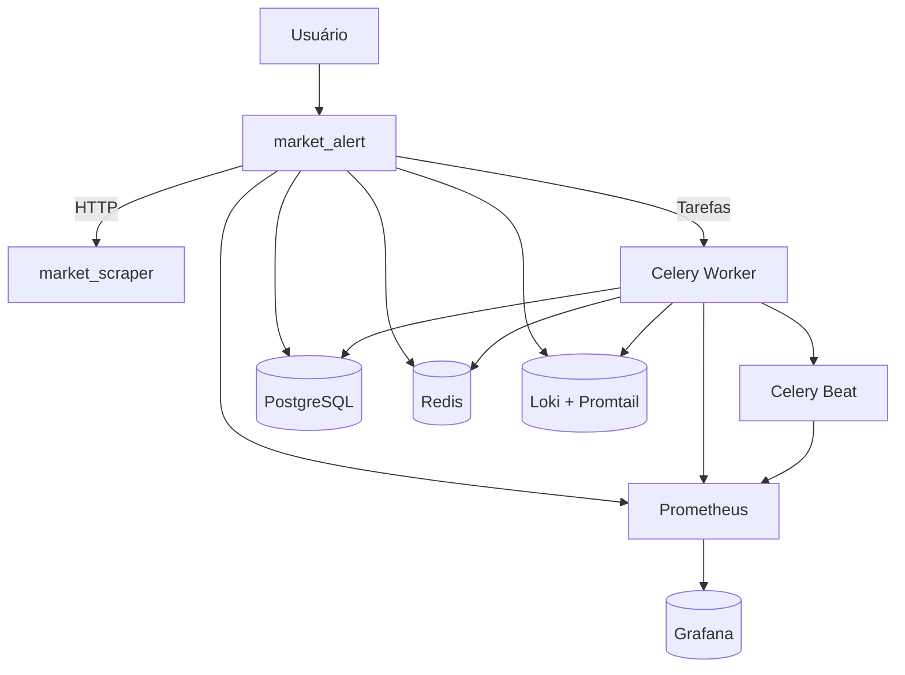

# Market Suite
Market Suite (nome de desenvolvimento) é uma plataforma composta por serviços independentes para monitoramento de preços e envio
de alertas. A solução é dividida em três módulos principais:

- **market_alert** - API FastAPI responsável por gerenciar usuários, produtos monitorados, comparação de preços, regras de alertas e notificações. As tarefas assíncronas são executadas com **Celery**.
- **market_scraper** - microsserviço dedicado exclusivamente ao *web scraping*. Ele recebe uma URL e devolve as informações extraídas do anúncio.
- **shared** - componentes, utilitários e métricas compartilhadas entre os dois serviços.

A orquestração completa dos serviços é feita pelo arquivo ``docker-compose.yml``, que sobe banco de dados, Redis, API, workers e toda a stack de observabilidade de forma integrada.

## Visão Geral da Arquitetura
O diagrama abaixo apresenta como os serviços se comunicam e quais componentes externos são necessários para o funcionamento do sistema.

```mermaid
graph TD
    User[Usuário] --> API[market_alert]
    API --> |HTTP| Scraper[market_scraper]
    API --> |Tarefas| Worker[Celery Worker]
    Worker --> Beat[Celery Beat]
    API --> DB[(PostgreSQL)]
    Worker --> DB
    API --> Cache[(Redis)]
    Worker --> Cache
    API --> Prometheus
    Worker --> Prometheus
    Beat --> Prometheus
    Prometheus --> Grafana[(Grafana)]
    API --> Loki[(Loki + Promtail)]
    Worker --> Loki
```
* **Usuário → market_alert** - o usuário interage apenas com a API principal.
* **market_alert → market_scraper** - a API encaminha solicitações de coleta para o serviço de scraping.
* **Celery Worker** executa as tarefas assíncronas agendadas pela API, como scraping, comparação de preços e envio de notificações.
* **Celery Beat** agenda execuções periódicas para rechecagens de produtos e coleta de **métricas**.
* **PostgreSQL e Redis** armazenam dados persistentes e caches temporários.
* **Prometheus e Loki** coletam métricas e logs que podem ser visualizados no Grafana.

## Benefícios da Arquitetura
- **Separação de responsabilidades**: o serviço de scraping evolui independentemente da API principal, reduzindo acoplamento.
- **Escabilidade**: cada módulo pode ser escalado de forma isolada conforme a carga de trabalho
- **Reutilização**: recursos comuns ficam centralizados no diretório ``shared``, evitando código duplicado.
- **Observabilidade unificada**: métricas e logs são coletados de todos os serviços de maneira consistente. 

## Estrutura de Diretórios
```
market_alert/     # API principal e tarefas Celery
market_scraper/   # Serviço de scraping
shared/           # Utilidades e componentes em comum
```

## Serviço ``market_alert``
O `market_alert` centraliza a API e orquestra as tarefas assíncronas do sistema. Ele expõe endpoints REST, persiste dados no PostgreSQL e interage com o `market_scraper`
para coletar informações dos anúncios.

### Componentes principais
- **main.py** - inicializa a aplicação FastAPI, configura métricas e rate limiting e registra as rotas.
- **core/** - carrega variáveis de ambiente e define o ``Celery`` com filas e agendamentos.
- **routes/**, **schemas/** e **services/** - implementam os endpoints, validam dados e aplicam regras de monitoramento, comparação e alerta.
- **tasks/** - tarefas ``Celery`` para scraping, comparação de preços e envio de notificações.
- **notifications/** - gerencia o envio por e-mail, SMS, push, WhatsApp ou Slack.
- **models/** e **crud/** - mapeiam as tabelas e realizam operações no banco de dados.
- **utils/** e **templates/** - utilidades e modelos usados na geração das mensagens.

### Fluxo de monitoramento
1. A rota ``/monitored/scrape`` agenda a coleta de um produto no `Celery`.
2. A tarefa consulta o ``market_scraper``, atualiza o banco e dispara a comparação de preços.
3. Se alguma regra for atendida, uma nova tarefa envia as notificações pelos canais configurados.
4. Tarefas periódicas reexecutam verificações e expõem métricas em ``/metrics``.

### Resultados esperados de ``market_alert``
- Endpoints retornam confirmações de agendamento enquanto as tarefas populam o banco.
- Registros de comparação detalham preço médio, menor preço e discrepâncias.
- Métricas de API, filas e notificações ficam disponíveis para observabilidade.

## Serviço ``market_scraper``
O `market_scraper` é o serviço especializado em coletar dados de anúncios. Ele processa uma URL recebida, respeitando limites de acesso e retornando informações estruturadas para os demais módulos.

Para uma visão detalhada da arquitetura de scraping leve baseada em JSON e HTML estático consulte [`market_scraper/README.md`](market_scraper/README.md).

### Fluxo unificado de scraping
- Todas as requisições passam exclusivamente pelo `SynergicPipeline`, que coordena as etapas declaradas no arquivo `domain_policy.yaml`.
- A política de domínio define **quais etapas** serão executadas, **em qual ordem** e **qual modo de execução** (`sequential`, `parallel` ou `conditional`).
- Cada etapa atualiza o `shared_context`, um dicionário mutável utilizado para compartilhar HTML bruto, dados estruturados e metadados entre as etapas subsequentes.
- Métricas e logs estruturados são emitidos por etapa, permitindo rastrear latência, sucessos, fallbacks e bloqueios no Prometheus e no Loki.

### Componentes principais
- **main.py** - instancia a aplicação FastAPI e registra rotas de saúde e de scraping.
- **routes/** - expõe as rotas ``/health/ping`` e ``/scrape/parse`` (também acessível por ``/scraper/parse``).
- utiliza o contrato ``ScraperRequest`` e ``ScraperResponse`` definido em ``shared/schemas/schemas_scraper.py`` para padronizar requisições e respostas.
- **services/** - executa o fluxo de scraping controlando rate limiting, circuit breaker, cache inteligente e a orquestração do `SynergiPipeline`.
- **services/domain_policy.py** - carrega o `domain_policy.yaml`, aplica hot reload opcional e constrói as etapas do pipeline para cada domínio/contexto suportado.
- **services/pipeline_steps.py** - catálogo de etapas reutilizáveis; cada classe herda de `PipelineStep` e implementa o método `run` recebendo e atualizando o `shared_context`.
- **utils/** - reúne auxiliares como rotação de *user agent*, gerenciamento de cookies, delays humanizados, leitura de ``robots.txt`` e funções de preço.
- **tests/** - contém testes unitários, de integração e de performance para garantir robustez do serviço, incluindo cenários que validam a seleção de etapas via YAML.

Os parsers de HTML e dados estruturados residem em `market_scraper/parsers`, cada módulo responsável apenas por transformar o HTML bruto em um dicionário padronizado. Os `SynergicPipeline` concentra toda a orquestração e fallback, evitando estratégias isoladas.

### Papel na arquitetura
- Recebe requisições HTTP do ``market_alert`` ou de outros consumidores.
- Executa scraping exclusivamente por meio do pipeline configurado, garantindo consistência e flexibilidade via YAML.
- Em caso de bloqueios ou CAPTCHA, tenta recuperar o acesso e retorna error claros quando necessário, registrando métricas por etapa.

## Módulo compartilhado ``shared``
O diretório ``shared`` concentra componentes reutilizáveis que dão suporte aos demais serviços.

### Organização
- ``__init__.py`` e ``exceptions.py`` - identificam o pacote e centralizam a exceção `ScraperError`.
- ``core/`` - configurações base e utilitários para leitura de variáveis de ambiente.
- ``enums/`` - enumerações de códigos de erro e resultados de bloqueios.
- ``infra/`` - infraestrutura comum localizada em ``shared/infra``: base ORM, scripts Redis e arquivos de observabilidade.
- ``metrics/`` - métricas Prometheus para HTTP, banco, cache, Celery e scraping.
- ``schemas/`` - modelos Pydantic que definem o contrato de dados entre os serviços, incluindo ``schemas_scraper.py`` com ``ScraperRequest`` e ``ScraperResponse``.
- ``utils/`` - funções auxiliares como normalização de URLs, mascaramento de logs e cliente Redis.
- ``tests/`` - testes que validam a integração e a consistência dos utilitários compartilhados.

### Papel na arquitetura
Os serviços ``market_alert`` e ``market_scraper`` importam esses recursos para compartilhar configurações, contratos de dados,
infraestrutura e métricas. Isso elimina duplicidade, padroniza o tratamento de erros e simplifica a manutenção da suíte.

## Como o sistema funciona
1. O usuário cria sua conta, autentica-se e obtém um token JWT para acessar a API
2. Com o token, cadastra URLs para monitoramento; a API agenda coletas e comparações no Celery.
3. O Celery Worker processa as tarefas, persiste dados no PostgresSQL e usa o Redis para estados rápidos.
4. O Celery Beat agenda rechecagens de produtos e coleta métricas de forma periódica.
5. Quando as regras de alerta são atendidas, o serviço de notificações envia mensagens pelos canais configurados.
6. Métricas e logs estruturados são expostos ao Prometheus e ao Loki para acompanhamento no Grafana.


## Primeiros Passos
### Requisitos
Antes de iniciar, garanta que os seguintes itens estão instalados:

* **Python 3.10+**
* **Docker e Docker Compose** (para execução completa do ambiente)
* **Redis** e **PostgreSQL** (caso opte por executar os serviços sem Docker)
* **Playwright** para coleta via navegador headless (Desativado nessa etapa do projeto)

1. Criar um ambiente virtual e instalar as dependências:
```bash
python -m venv .venv
source .venv/bin/activate
pip install -r requirements.txt
# fora do Docker
playwright install chromium
```

2. Configurar as variáveis de ambiente. O projeto utiliza três arquivos `.env`:
   - `./.env.common` - localizado na RAIZ do projeto
   - `market_alert/.env.market_alert`
   - `market_scraper/.env.market_scraper`

### Exemplo de ``.env.common``
```env
POSTGRES_USER=usuario
POSTGRES_PASSWORD=senha
POSTGRES_DB=banco_de_dados
DATABASE_URL=postgresql+psycopg2://usuario:senha@db:5432/banco_de_dados

REDIS_PASSWORD=senha

GF_SECURITY_ADMIN_USER=usuario_grafana
GF_SECURITY_ADMIN_PASSWORD=senha_para_grafana
GF_USERS_ALLOW_SIGN_UP=false
GF_PATHS_PROVISIONING=caminho_do_grafana

SLACK_WEBHOOK_URL=https://sua_url

SMTP_HOST=smtp.example.com
SMTP_PORT=587
SMTP_USERNAME=usuario
SMTP_PASSWORD=senha
SMTP_TLS=1
SMTP_FROM=alertas@example.com

TWILIO_ACCOUNT_SID=ACxxxxxxxxxxxxxxx
TWILIO_AUTH_TOKEN=xxxxxxxxxxxxxxxxxx
TWILIO_SMS_FROM=+5511999999999
TWILIO_WHATSAPP_FROM=+5511999999999

FCM_SERVER_KEY=AAAxxxxxxxxxxxxxxxxxxxx:APA91bG...

SECRET_KEY=sua_chave_secreta

LOCUST_HOST=http://host:0000
LOCUST_LOGIN_EMAIL=email_do_usuario@exemplo.com
LOCUST_LOGIN_PASSWORD=senha_do_usuario_exemplo

```
> **Nota:** ``LOCUST_LOGIN_EMAIL`` e ``LOCUST_LOGIN_PASSWORD`` devem permanecer a um usuário real.

### Exemplo de ``.env.market_alert``
```env
DATABASE_URL=postgresql+psycopg2://usuario:senha@db:5432/banco_de_dados

REDIS_PASSWORD=senha

SMTP_HOST=smtp.example.com
SMTP_PORT=587
SMTP_USERNAME=usuario
SMTP_PASSWORD=senha
SMTP_TLS=1
SMTP_FROM=alertas@example.com

TWILIO_ACCOUNT_SID=ACxxxxxxxxxxxxxxx
TWILIO_AUTH_TOKEN=xxxxxxxxxxxxxxxxxx
TWILIO_SMS_FROM=+5511999999999
TWILIO_WHATSAPP_FROM=+5511999999999

FCM_SERVER_KEY=AAAxxxxxxxxxxxxxxxxxxxx:APA91bG...

SECRET_KEY=sua_chave_secreta

ADAPTIVE_RECHECK_BASE_INTERVAL=7200

SLACK_WEBHOOK_URL=https://sua_url

SCRAPER_SERVICE_URL=http://url_serviço_de_scraping

```

### Exemplo de ``.env.market_scraper``
```env
REDIS_PASSWORD=senha

CACHE_BASE_TTL=3600

ETAG_CACHE_TTL=86400
SIG_CACHE_TTL=86400

SCRAPER_STRATEGIES=playwright

HUMAN_AVG_WPM=200
HUMAN_BASE_DELAY=1.0
HUMAN_FATIGUE_MIN=0.5
HUMAN_FATIGUE_MAX=2.0

THROTTLE_RATE=0.2
THROTTLE_CAPACITY=3

JITTER_MIN=2.0
JITTER_MAX=7.0

MONITORED_RATE_LIMIT=100
COMPETITOR_SERVICE_RATE_LIMIT=200

RATE_LIMIT_WINDOW=3600

PLAYWRIGHT_HEADLESS=1
PLAYWRIGHT_TIMEOUT=30000

```

## Pipeline de Scraping
O fluxo completo integra API, Celery e ``SynergicPipeline``:

1. A API agenda a coleta e envia a URL para o ``markeT_scraper``.
2. O serviço consulta o ``IntelligentCacheManager`` para decidir se uma resposta 304 pode ser retornada sem nova coleta.
3. O ``domain_policy.yaml`` define quais estratégias e etapas devem ser executadas para o domínio/contexto solicitado.
4. O ``SynergicPipeline`` executa as etapas registradas, compartilhando contexto e aplicando fallbacks automático até encontrar um resultado válido ou esgotar as alternativas.
5. O resultado validado é armazenado em cache, métricas são registradas e a resposta estruturada é devolvida à API para persistência ou comparação.

### Proteções ativas por camada
1. **RateLimiter** - aplicado logo na entrada das requisições para garantir que a cota de acessos por janela não seja excedida (respostas ``429`` quando o limite é atingido).
2. **CircuitBreaker** - monitora falhas consecutivas (403/429/timeouts) e abre o circuito para o domínio afetado, evitando insistir em endpoints indisponíveis.
3. **HumanizedDelayManager** e **ThrottleManager** - adicionam jitter e controlam a cadência das chamadas para simular comportamento humano e respeitar limites contratuais.
4. **BlockRecoverymanager** - identifica CAPTCHAs ou padrões de bloqueio; quando não há recuperação possível o evento é registrado em métricas e logs estruturados.
5. **AdaptiveRecheckManager** e **InteligentCacheManager** - ajustam os intervalos de rechecagem com base em históricos de mudanças e mantêm os dados em cache com TTL, ETag e assinatura para reduzir acessos redundates.

## Execução
Para levantar todo o ambiente com banco de dados, Redis e serviços auxiliares utilize:
```bash
docker-compose up --build
```

Os serviços também podem ser executados manualmente: 
```bash
# market_scraper
uvicorn market_scraper.main:app --port 8001

# worker e beat do market_alert
celery -A market_alert.core.celery_app:celery_app worker --loglevel=info
python market_alert/beat_with_metrics.py

# API
uvicorn market_alert.main:app --port 8000
```

## Comunicação entre serviços
O `market_alert` envia requisições HTTP ao `market_scraper` para processar páginas. Exemplo:
```http
POST http://market_scraper:8001/scraper/parse
Content-Type: application/json

{
  "url": "https://exemplo.com/produto",
  "product_type": "monitored",
  "user_id": "<UUID>"
}
```

```json
{
  "name": "Produto Exemplo",
  "current_price": 99.90,
  "old_price": 120.0,
  "thumbnail": "https://img.exemplo.com/123.jpg",
  "free_shipping": true,
  "seller": "Loja X",
  "shipping": "Frete Grátis"
}
```

## Observabilidade
- Métricas expostas em `/metrics` (API, worker e beat) e coletadas pelo **Prometheus**.
- Logs enviados ao **Loki/Promtail**.
- Painéis de visualização no **Grafana** e alertas via **AlertManager**.
- Auditoria de scraping disponível em `/audit`.

### Metas 
- **Latência de scraping (P95)** ≤ 5 s.
- **Taxa de erros de scraping** ≤ 1 %.

## Testes
Execute a suíte de testes:
```bash
pytest
```

Exemplos de execução por módulo:

```bash
pytest market_alert     # Testes da API
pytest market_scraper   # Testes do scraper
pytest shared           # Testes dos componentes compartilhados
```

## Licença
Distribuído sob a [MIT License](LICENSE). (APENAS EXEMPLO)
