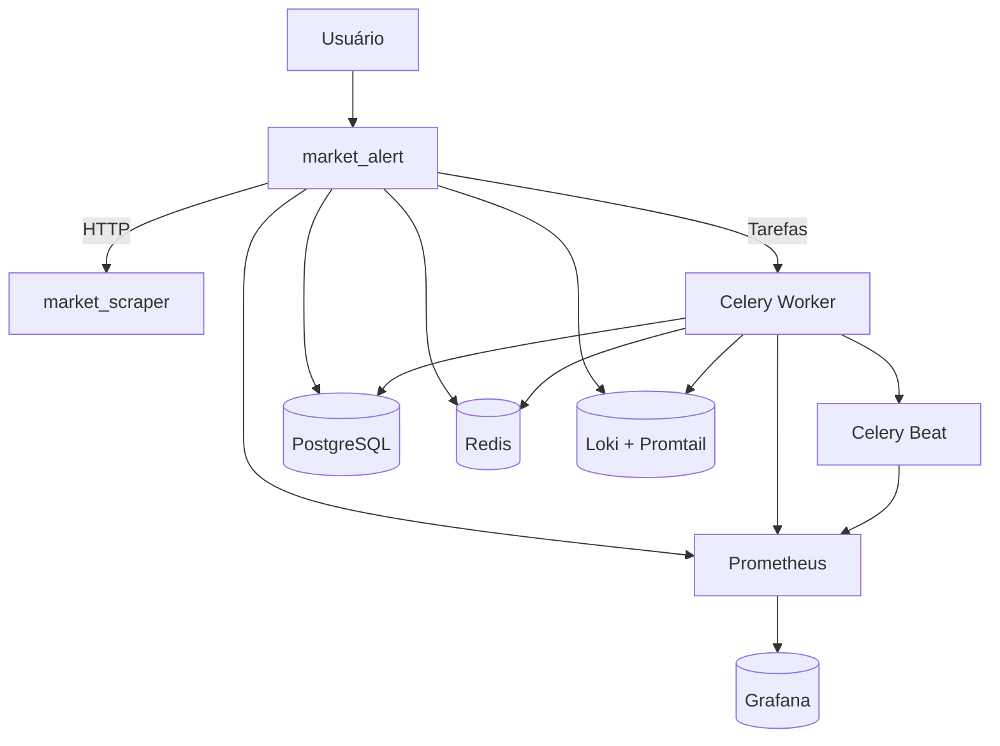

# Market Suite
Market Suite (nome de desenvolvimento) é uma plataforma composta por serviços independentes para monitoramento de preços e envio
de alertas. A solução é divida em três módulos principais:

- **market_alert** - API FastAPI responsável por gerenciar usuários, produtos monitorados, comparação de preços, regras de alertas e notificações. As tarefas assíncronas são executadas com **Celery**.
- **market_scraper** - microsserviço dedicado exclusivamente ao *web scraping*. Ele recebe uma URL e devolve as informações extraídas do anúncio.
- **shared** - componentes, utilitários e métricas compartilhadas entre os dois serviços.

## Visão Geral da Arquitetura

```mermaid
graph TD
    User[Usuário] --> API[market_alert]
    API --> |HTTP| Scraper[market_scraper]
    API --> |Tarefas| Worker[Celery Worker]
    Worker --> Beat[Celery Beat]
    API --> DB[(PostgreSQL)]
    Worker --> DB
    API --> Cache[(Redis)]
    Worker --> Cache
    API --> Prometheus
    Worker --> Prometheus
    Beat --> Prometheus
    Prometheus --> Grafana[(Grafana)]
    API --> Loki[(Loki + Promtail)]
    Worker --> Loki
```

DEVE CONTER EXPLICAÇÕES SOBRE O DIAGRAMA PROPOSTO ACIMA!

## Estrutura de Diretórios
```
market_alert/     # API principal e tarefas Celery
market_scraper/   # Serviço de scraping
shared/           # Utilidades e componentes em comun
```

## Como o sistema funciona
1. O usuário realiza requisições para a API via HTTP, normalmente usando um token JWT obtido no login.
2. A API registra tarefas no Celery para executar coletas de dados, comparação de preços e envio de alertas
3. O Celery Worker processa essas tarefas, persistindo informações no PostgreSQL e mantendo estados rápidos no Redis.
4. O Celery Beat agenda execuções periódicas para rechecagem de produtos e coleta de métricas.
5. Sempre que uma regra de alerta é satisfeita, o serviço de notificações dispara mensagens por email, SMS ou outros canais.
6. Métricas e logs estruturados são expostos ao Prometheus e ao Loki para acompanhamento no Grafana.


## Primeiros Passos
### Requisitos
- AQUI DEVE ESTAR INCLUIDO UMA LISTA COM REQUISITOS NECESSÁRIOS PARA INICIAR OS PRIMEIROS PASSOS

1. Criar um ambiente virtual e instalar as dependências:
```bash
python -m venv .venv
source .venv/bin/activate
pip install -r requirements.txt
# fora do Docker
playwright install chromium
```

2. Configurar as variáveis de ambiente. O projeto utiliza três arquivos `.env`:
- `./.env.common` - localizado mna RAIZ do projeto (Deve ser revisado essa informação, se a localização está correta)
- `market_alert/.env.market_alert`
- `market_scraper/.env.market_scraper`

### Exemplo de ``.env.common``
```env
POSTGRES_USER=usuario
POSTGRES_PASSWORD=senha
POSTGRES_DB=banco_de_dados
DATABASE_URL=postgresql+psycopg2://usuario:senha@db:5432/banco_de_dados

REDIS_PASSWORD=senha

GF_SECURITY_ADMIN_USER=usuario_grafana
GF_SECURITY_ADMIN_PASSWORD=senha_para_grafana
GF_USERS_ALLOW_SIGN_UP=false
GF_PATHS_PROVISIONING=caminho_do_grafana

SLACK_WEBHOOK_URL=https://sua_url

SMTP_HOST=smtp.example.com
SMTP_PORT=587
SMTP_USERNAME=usuario
SMTP_PASSWORD=senha
SMTP_TLS=1
SMTP_FROM=alertas@example.com

TWILIO_ACCOUNT_SID=ACxxxxxxxxxxxxxxx
TWILIO_AUTH_TOKEN=xxxxxxxxxxxxxxxxxx
TWILIO_SMS_FROM=+5511999999999
TWILIO_WHATSAPP_FROM=+5511999999999

FCM_SERVER_KEY=AAAxxxxxxxxxxxxxxxxxxxx:APA91bG...

SECRET_KEY=sua_chave_secreta

LOCUST_HOST=http://host:0000
LOCUST_LOGIN_EMAIL=email_do_usuario@exemplo.com
LOCUST_LOGIN_PASSWORD=senha_do_usuario_exemplo

```

### Exemplo de ``.env.market_alert``
```env
DATABASE_URL=postgresql+psycopg2://usuario:senha@db:5432/banco_de_dados

SMTP_HOST=smtp.example.com
SMTP_PORT=587
SMTP_USERNAME=usuario
SMTP_PASSWORD=senha
SMTP_TLS=1
SMTP_FROM=alertas@example.com

TWILIO_ACCOUNT_SID=ACxxxxxxxxxxxxxxx
TWILIO_AUTH_TOKEN=xxxxxxxxxxxxxxxxxx
TWILIO_SMS_FROM=+5511999999999
TWILIO_WHATSAPP_FROM=+5511999999999

FCM_SERVER_KEY=AAAxxxxxxxxxxxxxxxxxxxx:APA91bG...

SECRET_KEY=sua_chave_secreta

ADAPTIVE_RECHECK_BASE_INTERVAL=7200

SLACK_WEBHOOK_URL=https://sua_url

SCRAPER_SERVICE_URL=http://url_serviço_de_scraping

```

### Exemplo de ``.env.market_scraper``
```env
CACHE_BASE_TTL=3600

HUMAN_AVG_WPM=200
HUMAN_BASE_DELAY=1.0
HUMAN_FATIGUE_MIN=0.5
HUMAN_FATIGUE_MAX=2.0

THROTTLE_RATE=0.2
THROTTLE_CAPACITY=3

JITTER_MIN=2.0
JITTER_MAX=7.0

MONITORED_RATE_LIMIT=100
COMPETITOR_SERVICE_RATE_LIMIT=200

RATE_LIMIT_WINDOW=3600

PLAYWRIGHT_HEADLESS=1
PLAYWRIGHT_TIMEOUT=30000

```

## Guia de Uso para o Usuário Final e Funcionamento do Sistema

AQUI DEVE SER UM GUIA DE COMO O USUÁRIO UTILIZA E SE COMUNICA COM O SISTEMA, E TAMBÉM UM BREVE RESUMO EXPLICATIVO DO FUNCIONAMENTO DO SISTEMA


## Pipeline de Scraping
SERIA INTERESSANTES DOCUMENTAR SOBRE A PIPELINE DE SCRAPING INCLUIDA NO PROJETO, MAS DOCUMENTAR DE UMA MANEIRA INTERESSANTE E BEM EXPLICADA, ASSIM INFORMANDO COMO ESTÁ FUNCIONANDO O A COLETA DE DADOS VIA SCRAPING


## Execução
Para levantar todo o ambiente com banco de dados, Redis e serviços auxiliares utilize:
```bash
docker-compose up --build
```

Os serviços também podem ser executados manualmente: 
```bash
# market_scraper
uvicorn market_scraper.main:app --port 8001

# worker e beat do market_alert
celery -A market_alert.core.celery_app:celery_app worker --loglevel=info
python market_alert/beat_with_metrics.py

# API
uvicorn market_alert.main:app --port 8000
```

## Comunicação entre serviços
O `market_alert` envia requisições HTTP ao `market_scraper` para processar páginas. Exemplo:
```http
POST http://market_scraper:8001/scraper/parse
Content-Type: application/json

{
  "url": "https://exemplo.com/produto",
  "product_type": "monitored",
  "user_id": "<UUID>"
}
```

```json
{
  "name": "Produto Exemplo",
  "current_price": 99.90,
  "old_price": 120.0,
  "thumbnail": "https://img.exemplo.com/123.jpg",
  "free_shipping": true,
  "seller": "Loja X",
  "shipping": "Frete Grátis"
}
```

## Observabilidade
- Métricas expostas em `/metrics` (API, worker e beat) e coletadas pelo **Prometheus**.
- Logs enviados ao **Loki/Promtail**.
- Painéis de visualização no **Grafana** e alertas via **AlertManager**.
- Auditoria de scraping disponível em `/audit`.

## Testes
Execute a suíte de testes:
```bash
pytest
```

## Licença
Distribuído sob a [MIT License](LICENSE). (APENAS EXEMPLO)

