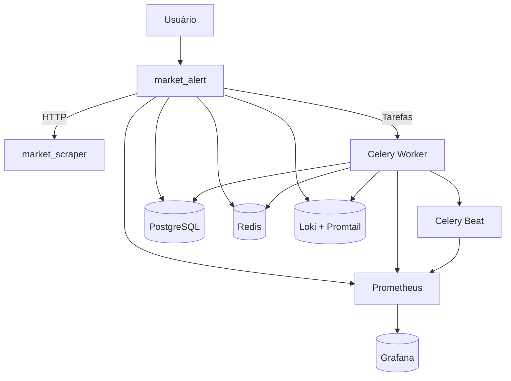

# Market Suite
Market Suite é uma suíte de serviços especializados para monitoramento de preços e disparo de alertas. O projeto é composto por microserviços independentes que se comunicam por HTTP e filas Celery, mantendo contratos compartilhados no diretório [`shared/`](shared/).

## Serviços e responsabilidades

| Serviço | Função principal | Documentação dedicada |
|---------|------------------|-----------------------|
| **market_alert** | expõe a API pública, agenda tarefas Celery, persiste dados e interpreta as respostas do scraper. | [`market_alert/README.md`](market_alert/README.md) |
| **market_scraper** | realiza o download da página, aplica o pipeline de parsing e devolve um `ParseResponse` consolidado. | [`market_scraper/README.md`](market_scraper/README.md) |
| **shared** | concentra contratos, métricas e utilidades comuns às duas aplicações. | [`shared/`](shared/) |

A orquestração completa é realizada pelo [`docker-compose.yml`](docker-compose.yml), que sobe banco de dados, Redis, workers Celery e a stack de observabilidade.

## Visão Arquitetural

```mermaid
graph TD
    User[Usuário] --> API[market_alert]
    API --> |HTTP| Scraper[market_scraper]
    API --> |Tarefas| Worker[Celery Worker]
    Worker --> Beat[Celery Beat]
    API --> DB[(PostgreSQL)]
    Worker --> DB
    API --> Cache[(Redis)]
    Worker --> Cache
    API --> Prometheus
    Worker --> Prometheus
    Beat --> Prometheus
    Prometheus --> Grafana[(Grafana)]
    API --> Loki[(Loki + Promtail)]
    Worker --> Loki
```

### Fluxo Ponta a Ponta
1. Usuários autenticam e interagem somente com o `market_alert`.
2. A API agenda tarefas de scraping/comparação nas filas Celery e consulta o `market_scraper` sempre que precisa atualizar preços.
3. As tarefas persistem dados em PostgreSQL, utilizam Redis para caches/locks e geram métricas expostas em `/metrics`.
4. Quando regras de alerta são atendidas, notificações são disparadas pelos canais ativos.

## Contrato Compartilhado de Scraping
- O request aceito pelo scraper é definido em [`shared/schemas/schemas_scraper.py`](shared/schemas/schemas_scraper.py).
- O `ParseResponse` retorna `name`, `current_price`, `url`, `source` e um campo opcional `payload`. Em cenários sem dados válidos o serviço responde `no_result`.
- O `market_alert` nunca processa HTML diretamente; toda lógica de parsing pertence ao `market_scraper`.

## Executando o Projeto
```bash
docker compose up -d db redis redis-init
docker compose up -d api market_scraper celery-worker celery_beat
```
Interrompa com `docker compose down`. Todos os serviços respeitam variáveis definidas em `.env.common` e nos arquivos `.env.market_alert`/`.env.market_scraper`.

### Ambiente local
1. Crie uma `venv` e instale dependências: `python -m venv .venv && source .venv/bin/activate && pip install -r requirements.txt`.
2. Configure `.env.common`, `market_alert/.env.market_alert` e `market_scraper/.env.market_scraper`.
3. Inicie os serviços desejados conforme descrito nas documentações específicas.

## Observabilidade
- Cada serviço expõe métricas Prometheus em `/metrics` (API: `:8000`, Beat: `:8001`, Worker: `:8002`, Scraper: `:8010`).
- Logs estruturados são enviados para Loki quando o stack completo está em execução.
- Dashboards de referência estão no Grafana (`http://localhost:3000`).

## Estrutura do Repositório
```text
market_alert/ #API FastAPI, tarefas Celery e notificações
market_scraper/ #Microserviço de scraping com pipeline enxuto
shared/ #Contratos, métricas e utilidades comuns
```

## Documentação complementar 
- [`AGENTS.md`](AGENTS.md): manual operacional para agentes de IA e automações.
- Testes automatizados podem ser executados com `pytest` no diretórios dos serviços.


