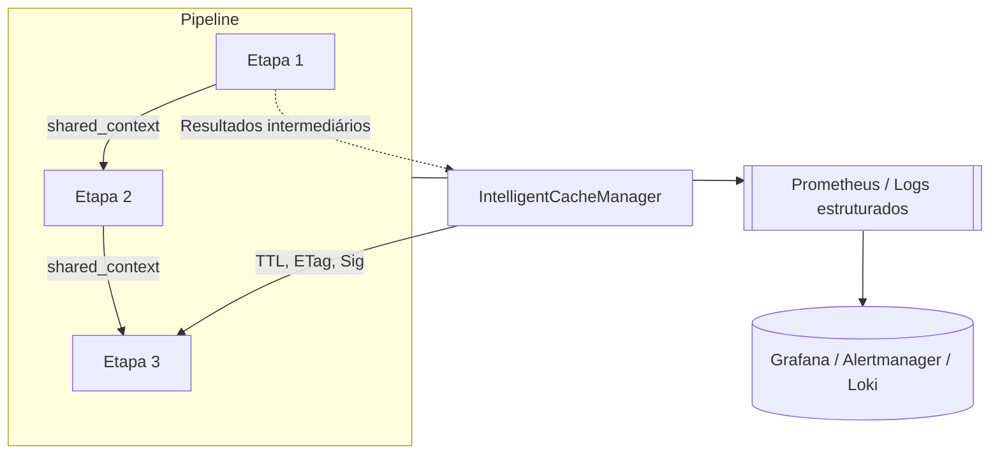

# Arquitetura de Scraping Leve
Este documento descreve o fluxo de coleta de dados do serviço `market_scraper` utilizando abordagens de baixo custo baseadas em **JSON**, **HTML estático** e pipeline sinérgico configurável.
O objetivo é extrair apenas os campos essenciais `name` e `current_price` de maneira discreta, com observabilidade, compliance e rollout controlado, evitando o uso de navegadores controlados pelo Playwright nesta fase do projeto.

## Visão Geral do Fluxo
1. A rota `/parse` recebe a URL do produto.
2. A função `scrape_product_common_async` normaliza o endereço, consulta o cache inteligente e aciona o `SynergicPipeline` definido no `domain_policy.yaml`.
3. O `SynergicPipeline` seleciona etapas conforme configuração centralizada e executa o modo configurado (`sequential`, `parallel` ou `conditional`).
4. Cada etapa lê e atualiza o `shared_context`, garantindo reaproveitamento de resultados e eliminando consultas duplicadas.
5. O `DataQualityvalidator` valida o retorno da etapa corrente; em caso de falha ou timeout, o pipeline aplica fallback automático para a próxima etapa disponível.
6. Resultados válidos são armazenados no `IntelligentCacheManager` e retornados ao solicitante, respeitando TTL, ETag e políticas de domínio.
7. Métricas e logs estruturados são registrados para observabilidade, permitindo acompanhar latência, sucessos, fallback e bloqueios por etapa.

## Políticas de Domínio e Configuração Centralizada
O módulo `domain_policy` mapeia cada marketplace para uma ordem de execução, contexto e modo de processamento:
- Etapas leves (extrações estruturadas) são priorizadas, seguidas por variações baseadas em HTML estático e renderização leve.
- O arquivo `domain_policy.yaml` centraliza etapas de pipeline, modos de execução (`sequential`, `parallel`, `conditional`), limites de requisições e feature flags.
- Contextos (ex: `default`, `competitor`) permitem granularidade por tipo de página ou cenário.
- Novas etapas ou domínios podem ser adicionados facilmente via YAML, sem alterar o core do código.

## Estratégias de Coleta e Pipeline

### Parsers especializados
Cada biblioteca de parsing possui um módulo dedicado em `market_scraper/parsers`:
- `html_static.py` mantém funções puras para parsing por BeautifulSoup
- `extruct.py`, `parsel.py`, `requests_html.py` e `selectorlib.py` seguem a mesma interface (`html`, `url` -> `dict`)
- As etapas do pipeline (`pipeline_steps`) apenas coordenam o uso dos parsers acima, respeitando o contexto compartilhado.

Todos os módulos retornam sempre o dicionário padronizado com `name`, `current_price` e `url`, simplificando a integração com o `SynergicPipeline`.

### HTML Estático
O módulo utilitário `market_scraper/parsers/html_static.py` concentra funções puras de parsing para cada marketplace suportado. Cada função recebe apenas o HTML bruto e a URL original, retornando um dicionário com `name` e `current_price`.
A extração prioriza seletores simples via BeautifulSoup, e é consumida diretamente pelas etapas do pipeline configuradas via YAML.
### SelectorLib
Para páginas instáveis, usamos **SelectorLib** com templates YAML em `selectorlib_templates`.

### Pipeline Sinérgico
O `SynergicPipeline` executa etapas configuráveis por domínio/contexto, compartilhando dados via `shared_context` e registrando métricas de latência, fallback e sucesso/falha. Todas as chamadas de scraping passam exclusivamente pelo pipeline, evitando orquestrações paralelas ou estratégias isoladas e garantindo que a política definida no YAML seja a única fonte de verdade para o fluxo de coleta.

#### Uso do `shared_context`
- Utilize chaves semânticas (`html_raw`, `json_ld`, `offers`, `cookies_rotacionados`) para registar dados acessíveis às etapas subsequentes.
- Prefira atualizar valores existentes ao invés de sobrescrever todo o dicionário; o método `shared_context.update(...)` mantém consistência entre as etapas.
- Remova dados sensíveis antes de finalizar a etapa, garantindo compliance com LGPD/GDPR.
- Documente no docstring da etapa quais chaves são lidas ou atualizadas, facilitando a criação de novas etapas compatíveis

### Etapas configuráveis
As etapas disponíveis são declaradas em `services/pipeline_steps.py` e registradas no YAML (`pipeline_steps`). Cada etapa pode:
- Carregar HTML de diferentes fontes (requisições estáticas, renderização leve, login mecânico);
- Executar parsers especializados reutilizando resultados anteriores;
- Inserir dados adicionais no `shared_context` (cookies, assinaturas de conteúdo, templates do SelectorLib).

A composição final do pipeline é definida por domínio em `pipeline_policies`, permitindo rearranjar etapas ou criar sequências exclusivas para contextos como `competitor`. Essa padronização elimina duplicação de código e facilita a evolução das etapas.

## MechanicalSoup para Fluxos Simples
Utilizado para interações leves (login, filtros simples), combinando `requests` e `BeautifulSoup` sem overhead de navegador completo. Playwright é reservado para cenários avançados e não está ativo por padrão.

## Requests-HTML para Páginas Dinâmicas Leves
Utilizado para páginas que exigem renderização simples de JavaScript. Prefira Requests-HTML antes de recorrer ao Playwright. Limitações: depende de `pyppeteer`, não realiza navegação avançada, pode consumir mais recursos.

## Rollout, Feature Flags e Observabilidade
O rollout de funcionalidades críticas (ex: pipeline sinérgico) é controlado por feature flags no `domain_policy.yaml`, permitindo ativação gradual por domínio/contexto e rollback imediato.
- Métricas Prometheus (`SCRAPER_FEATURE_FLAG_TOTAL`, `SCRAPER_STRATEGY_TOTAL`, `SCRAPER_FALLBACK_TOTAL`, `SCRAPING_LATENCY_SECONDS`) monitoram decisões, latência e fallback.
- Logs estruturados registram decisões de rollout, execuções e bloqueios.
- O plano de rollout e rollback está documentado e testado, garantindo governança e rastreabilidade.

## Segurança, Compliance e Limites
- Respeito ao `robots.txt` antes de qualquer coleta.
- Limites de requisições por domínio configurados no YAML e aplicados via `RateLimiter` e `ThrottleManager`.
- Logs passam por sanitização (`sanitize_log_data`), evitando registro de dados sensíveis (cookies, tokens, credenciais).
- Coleta apenas dos campos essenciais, conforme LGPD/GDPR.

## Extensibilidade e Exemplos Práticos
Para adicionar novas etapas ou domínios:
1. Implemente a classe derivando de `PipelineStep` ou reutilize parsers existentes.
2. Garanta que a docstring da etapa descreva entradas, saídas e chaves do `shared_context` utilizadas.
3. Registre no `domain_policy.yaml` em `pipeline_steps`
4. Defina a ordem e contexto em `pipeline_policies` e selecione o modo em `pipeline_execution`
5. Atualize testes unitários/integrados que validam a montagem do pipeline e as rotas que dependem do contexto.
6. Monitore métricas após deploy para ajustes finos.

### Como adicionar um novo parser puro
1. Crie um módulo em `market_scraper/parsers` seguindo a interface padrão (`html`, `url` -> `dict`).
2. Documente o comportamento com docstrings e exemplos em português.
3. Adicione testes unitários dedicados em `market_scraper/tests/unit/services`.
4. Integre o parser a uma etapa do pipeline atualizando o YAML quando necessário.

Exemplo de rollout:
```yaml
feature_flags:
  synergic_pipeline:
    mercadolivre.com.br:
      default:
        enabled: true
        rollout_percentage: 40
      competitor:
        enabled: false
```
Permite ativar o pipeline para 40% das requisições, com rollback imediato via YAML.

## Métricas e Monitoramento
Principais métricas Prometheus:
| Métrica | Descrição |
| ------- | --------- |
| `SCRAPER_STRATEGY_TOTAL` | Contador por etapa e status |
| `SCRAPER_FALLBACK_TOTAL` | Fallbacks acionados |
| `SCRAPING_LATENCY_SECONDS` | Latência por etapa |
| `SCRAPER_FEATURE_FLAG_TOTAL` | Decisões de rollout |
| `SCRAPER_HTTP_BLOCKED_TOTAL` | Bloqueios por rate limit ou robots.txt |
| `SCRAPER_URL_STATUS_TOTAL` | Status por domínio |

Dashboards Grafana e alertas Prometheus/Loki acompanham rollout, latência, taxa de sucesso e compliance.

## Resultado Esperado
Para cada URL, o serviço retorna um dicionário com `name` e `current_price`. Se o conteúdo não mudou, responde **304 Not Modified**. Bloqueios sucessivos podem suspender temporariamente o scraping.

## Checklist de Extensão e Compliance
- [x] Configuração centralizada no YAML
- [x] Código modular e extensível
- [x] Documentação e exemplos completos
- [x] Testes aprovados e cobertura validada
- [x] Observabilidade e compliance garantidos

## Referências Rápidas
- `AGENTS.md`: guia operacional para agentes e automações
- `market_scraper/services/domain_policy.yaml`: configuração centralizada
- `shared/metrics/metrics_scraper.py`: métricas e observabilidade
- `tests/unit/services/test_domain_policy.py`: exemplos de testes de seleção/contexto

### Configuração centralizada (`domain_policy.yaml`)
O arquivo ``services/domain_policy.yaml`` centraliza todas as decisões de orquestração do scraper;
Ele define:
- **`pipeline_steps`** - cataloga as etapas do ``SynergicPipeline`` capazes de compartilhar contexto.
- **`pipeline_policies`** - descreve, por domínio e contexto, a ordem das etapas executadas pelo pipeline.
- **`pipeline_execution`** - especifica o modo de execução (`sequential`, `parallel`, `conditional`).
- **`rate_limits`** - define limites de requisições por domínio.
- **`feature_flags`** - controla o rollout de funcionalidades sensíveis.

```yaml
#Trechos ilustrativos do arquivo domain_policy.yaml
pipeline_steps:
  extruct: ExtructExtractionStep
  parsel: ParselExtractionStep
  requestshtml: RequestsHTMLRenderStep
  selectorlib: SelectorLibExtractionStep

pipeline_policies:
  mercadolivre.com.br:
    default:
      - extruct
      - parsel
      - requestshtml
      - selectorlib
    competitor:
      - requestshtml
      - selectorlib
      - parsel

pipeline_execution:
  default:
    default: sequential
    competitor: sequential
  mercadolivre.com.br:
    default: conditional
    competitor: conditional
```

Cada contexto representa um cenário configurável (por exemplo, `product_type=competitor`).
Caso um contexto não seja encontrado para o domínio, o bloco `default` é utilizado automaticamente.
Isso permite priorizar etapas mais leves para páginas monitoradas e reservar opções mais robustas apenas quando o usuário solicita comparações de concorrentes.

> Variáveis de ambiente permitem customizar a configuração sem alterar o código
> - ``DOMAIN_POLICY_FILE`` aponta para outro arquivo YAML.
> - ``DOMAIN_POLICY_HOT_RELOAD=1`` ativa recarga automática quando o arquivo é alterado

#### Fluxo operacional e fallback do pipeline
O ``SynergicPipeline`` garante que as etapas sigam uma ordem previsível, reutilizando intermediários e registrando métricas de latência e fallback.

```mermaid
flowchart LR
    A[Requisição /scrape/parse] ---> B{Cache válido?}
    B -- Sim --> C[Retorno imediato (304 ou cache hit)]
    B -- Não --> D[Carregar domain_policy.yaml]
    D --> E[Selecionar etapas por domínio/contexto]
    E --> F[Executar SynergicPipeline]
    F --> G{Etapa bem-sucedida?}
    G -- Sim --> H[Validação e DataQuality]
    H --> I[Armazenar no IntelligentCacheManager]
    I --> J[Responder API]
    G -- Não --> K[Incrementar métricas de fallback]
    K --> F
```

Durante a execução:

1. O cache inteligente é consultado antes de iniciar etapas custosas.
2. A ordem de fallback é definida no ``domain_policy.yaml`` e percorre as alternativas até encontrar um resultado válido.
3. Cada etapa registra métricas estruturadas (tempo, status e fallback) para análise posterior no Prometheus.
4. O processamento pode ser **sequencial**, **paralelo** ou **condicional**, conforme o parâmetro ``execution_mode`` do ``SynergicPipeline``.

#### Contexto compartilhado, cache e métricas
As etapas compartilham informações pelo ``shared_context``. Isso reduz requisições redundantes (por exemplo, reaproveitando HTML pré-processado) e facilita instrumentação.



- **Cache inteligente**: ``IntelligentCacheManager`` usa TTL, ETag e assinatura de conteúdo para evitar coletas redundantes.
- **Contexto compartilhado**: etapas podem inserir dados em ``shared_context`` (cookies, HTML bruto, headers) para as próximas etapas.
- **Métricas**: o módulo ``shared.metrics`` expõe contadores e histogramas específicos do pipeline.

| Métrica Prometheus | Descrição |
| ------------------ | --------- |
| ``SCRAPER_STRATEGY_TOTAL`` | Contador por etapa (classe) e status: ``success``, ``NOT_MODIFIED`` ou falha. |
| ``SCRAPER_FALLBACK_TOTAL`` | Contabiliza quantas vezes um fallback foi acionado entre etapas configuradas. |
| ``SCRAPING_LATENCY_SECONDS`` | Histograma de latência individual por etapa. |

Essas métricas complementam as métricas HTTP padrão e devem ser acompanhadas com alertas (ex.: aumento de ``fallback_total``) para reagir a bloqueios ou mudanças nos marketplaces.

#### Como adicionar novas etapas
1. **Criar a classe** em ``market_scraper/services/pipeline_steps.py`` herdando de `PipelineStep` e garantindo validação com `DataQualityValidator`.
2. **Registrar a classe** no `domain_policy.yaml` em `pipeline_steps`.
3. **Definir a ordem** em `pipeline_policies` para domínio e contexto desejado (e.: `default`, `competitor`, `logged_user`).
4. **Ajustar o bloco `pipeline_execution`** para indicar como cada contexto será executado (`sequential`, `parallel` ou `conditional`).
5. **Adicionar Testes** cobrindo seleção e execução (``tests/unit/services/test_domain_policy.py`` contém exemplos atualizados).
6. **Monitorar métricas** após o deploy para ajustar TTL de cache, paralelismo ou limites.

#### Exemplo prático de extensão com nova biblioteca
Suponha que seja necessário utilizar uma etapa ``PlaywrightRenderStep`` apenas para páginas de concorrentes de um novo marketplace:

1. **Instale a dependência** e crie ``market_scraper/services/pipeline_steps.py`` implementando `PlawrightRenderStep` com validação e uso de `shared_context`.
2. **Registre a classe** em `domain_policy.yaml` dentro de ``pipeline_steps`` (ex.: `playwright_render: PlaywrightRenderStep`).
3. **Atualize `pipeline_policies`** para o domínio desejado definindo o contexto `competitor` com a nova etapa como último fallback. O contexto `default` pode continuar priorizando etapas leves.
4. **Ajuste `pipeline_execution`** para executar o contexto ``competitor`` em modo ``conditional`` (evitando que a etapa pesada rode quando o HTML já está disponível).
5. **Adicione testes** unitários/integrados garantindo que o contexto ``competitor`` seleciona a nova etapa e que o comportamento antigo permanece intacto para o contexto ``default``.

Esse fluxo garante que novas bibliotecas possam ser adicionadas de forma modular, habilitadas apenas quando configuradas via YAML e acompanhadas por métricas específicas.

#### Feature flags e rollout controlado
O arquivo ``domain_policy.yaml`` possui a seção ``feature_flags`` que controla funcionalidades sensíveis. Cada feature pode possuir valores por domínio e contexto, aceitando ``enabled`` (``true``/``false``) e ``rollout_percentage`` (0-100).
O valor final é determinado de forma determinística utilizando ``user_id`` e URL, permitindo liberar funcionalidades gradualmente sem inconsistências entre chamadas do mesmo usuário.

```yaml
feature_flags:
  synergic_pipeline:
    mercadolivre.com.br:
      default:
        enabled: true
        rollout_percentage: 40 #Ativa o pipeline para 40% das requisições
      competitor:
        enabled: false #mantém o comportamento anterior
```
* Valores ausentes herdam do bloco ``default``.
* ``rollout_percentage`` controla o canário: ``10`` significa que apenas 10% das requisições utilizarão a funcionalidade.
* Defina ``enabled: false`` (ou ``rollou_percentage: 0``) para realizar rollback imediato sem necessidade de deploy.

Ative ``DOMAIN_POLICY_HOT_RELOAD=1`` em desenvolvimento para testar novos percentuais sem reiniciar o serviço

#### Observabilidade do rollout
Três sinais principais acompanham a saúde do rollout:

1. **Métrica Prometheus ``scraper_feature_flag_total``**
  - Labels ``feature`` e ``state`` (`enabled`, `disabled`, `no_steps`).
  - Permite criar alertas (ex.: queda brusca na razão `enabled`/`disabled`).
2. **Logs estruturados**
  - `running_pipeline` inclui ``rollout`` e ``bucket_value`` indicando o percentual configurado e o valor sorteado para a requisição.
  - `pipeline_feature_disabled` e ``pipeline_skipped_no_steps`` sinalizam quando o pipeline não é executado por configuração.
3. **Métricas de latência e fallback**
  - ``SCRAPING_LATENCY_SECONDS`` e ``SCRAPER_FALLBACK_TOTAL`` ajudam a comparar o comportamento antes/depois do rollout.

Após alterações em ``feature_flags`` monitore:
- Grafana: dashboard do scraper (latência, taxa de sucesso, contadores ``scraper_feature_flag_total``).
- Loki: buscar eventos `pipeline_feature_disabled` para confirmar se o rollback foi aplicado.

#### Plano de rollout e rollback
1. **Preparação**
  - Ajuste o percentual inicial (ex.: 10%) no YAML e habilite hot reload em ambientes de teste.
  - Valide com testes automatizados (`pytest`) e smoke tests manuais.
2. **Rollout canário**
  - Publicar o YAML atualizado via pipeline de configuração.
  - Acompanhar ``scraper_feature_flag_total{state="enabled"}`` vs ``scraper_feature_flag_total{state="disabled"}``.
  - Observar histogramas de latência e logs de erro nos primeiros minutos.
3. **Escalonamento**
  - Se não houver regressões, aumentar gradualmente o ``rollout_parcentage`` (40% -> 70% -> 100%).
  - Documentar cada incremento no changelog interno.
4. **Rollback**
  - Em caso de falha, ajustar ``enabled: false`` ou ``rollout_percentage: 0`` e forçar recarga do YAML (hot reload ou restart leve).
  - Confirmar no Grafana que o contador `state="disabled"` voltou a subir e que não há novas execuções da feature.

Esses passos mantêm o serviço aderente às boas práticas de segurança (LGPD/GDPR), possibilitam auditoria das decisões e evitam instabilidade em produção.

#### Segurança, compliance e limites de scraping
- Respeitar ``robots.txt`` consultando ``utils/robots.txt`` antes de liberar novas rotas e durante tentativas de recuperação (`BlockRecoverymanager`, aborta quano o domínio proíbe o caminho).
- Utilizar ``ThrottleManager`` e ``RateLimiter`` para manter intervalos e janelas alinhados com os termos de uso; o contador `SCRAPER_HTTP_BLOCKED_TOTAL` é incrementado automaticamente quando o rate limit é atingido.
- Sanitizar logs com os utilitários de mascaramento de dados do diretório ``shared``; o serviço aplica `sanitize_log_data` para remover tokens, cookies e parâmetros sensíveis de URLs antes de registrar eventos.
- Configurar limites e comportamentos específicos por domínio no YAML, evitando que etapas pesadas sejam aplicadas indiscriminadamente. O bloco ``rate_limits`` define ``max_requests`` e ``window`` por host, refletidos em métricas no ``SCRAPER_URL_STATUS_TOTAL``.
- Seguir o princípio de minimização de dados (LGPD/GDPR), coletando apenas os campos essenciais (nome, preço, etc...).
- Documentar e revisar periodicamente exceções de compliance em conjunto com a equipe jurídica antes de ativar novas etapas.


## Serviços Utilitários
- **IntelligentCacheManager** - armazena resultados de produtos por domínio e URL para reduzir requisições repetidas.
- **DataQualityValidator** - garante que `name` e `current_price` estejam presentes e que o preço seja válido.
- **IntelligentUserAgentManager** - rotaciona `User-Agent` para cada requisição, evitando bloqueios.
- **BlockRecoveryManager** e **HumanizedDelayManager** - auxiliam na recuperação de bloqueios, rotacionam recursos e, após uma suspensão temporária, tentam nova requisição ou consultam o cache para obter o HTML, registrando o resultado em log.

## Resultado Esperado
Para cada URL o serviço retorna um dicionário com `name` e `current_price`. Se o conteúdo não mudou desde a última coleta o endpoint responde **304 Not Modified**.
Bloqueios sucessivos podem resultar em suspensão temporária do scraping.

## Decisões de Arquitetura e Migração
- **Descontinuação de estratégias isoladas**: versões anteriores executavam estratégias diretas (`structured_data_strategy`, `html_static_strategy`) sem o pipeline. Essas abrodagens foram removidas para reduzir divergência de comportamento entre domínios.
- **Fonte única de configuração**: o `domain_policy.yaml` é agora a única referência para ativar etapas, modos de execução e limites. Commits futuros que criem novas etapas devem incluir ajustes nesse arquivo.
- **Critérios para descartar etapas**: etapas que não atualizam o `shared_context`, não registram métricas ou divergem do contrato `PipelineStep` devem ser migradas ou removidas. As remoções precisam ser documentadas no YAML e acompanhadas por limpeza de métricas deprecatadas.
- **Boas práticas de migração**: antes de eliminar uma etapa antiga, mova seu comportamento para uma classe de pipeline compátivel, atualize a política correspondente e valide em ambiente de teste utilizando `DOMAIN_POLICY_HOT_RELOAD=1` para observar métricas em tempo real.

Essas decisões consolidam o `SynergicPipeline` como ponto central de evolução do serviço, mantendo observabilidade e compliance alinhadas às políticas de domínio.
