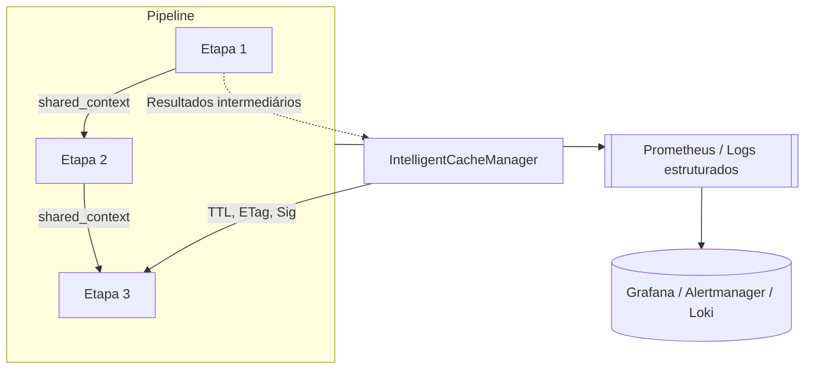

# Arquitetura de Scraping Leve
Este documento descreve o fluxo de coleta de dados do serviço `market_scraper` utilizando abordagens de baixo custo baseadas em **JSON** e **HTML estático**.
O objetivo é extrair apenas os campos essenciais `name` e `current_price` de maneira discreta, evitando o uso de navegadores controlados pelo Playwright nesta fase do projeto.

## Visão Geral do Fluxo
1. A rota `/parse` recebe a URL do produto.
2. A função `scrape_product_common_async` normaliza o endereço para a versão mobile, consulta o cache e aciona o orquestrador.
3. O `MultiStrategyScraperOrchestrator` seleciona as estratégias definidas pela política de domínio e executa cada uma em sequência com limite de tempo configurável via `asyncio.wait_for`.
4. Após cada tentativa os dados são validados pelo `DataQualityValidator`; timeouts ou falhas acionam fallback para a próxima estratégia.
5. Quando o resultado é válido ele é armazenado no `IntelligentCacheManager` e retornado ao solicitante.

## Políticas de Domínio
O módulo `domain_policy` mapeia cada marketplace para uma ordem de execução:
- Primeiro são tentadas estratégias leves que consomem **endpoints JSON** públicos.
- Caso não retornem dados, o orquestrador realiza fallback para estratégias de **HTML estático**.

Essa política facilita a inclusão de novos marketplaces e novas técnicas de extração. Basta registrar a classe no `STRATEGY_REGISTRY` e definir a ordem em `DOMAIN_POLICES`.

## Estratégias de Coleta
### JSON Endpoint
As classes derivadas de `JsonEndpointStrategy` executam chamadas HTTP a APIs públicas quando disponíveis. No momento, mantemos stubs e priorizamos HTML estático para Mercado Livre, Amazon e Magalu. Resultados válidos podem ser armazenados em cache para reutilização.

### HTML Estático
As estratégias herdadas de `HtmlStaticStrategy` agora priorizam Parsel (lxml) para parsing de HTML:
- Extração de `JSON-LD` via XPath: `//script[@type="application/ld+json"]/text()`
- Meta-tags via CSS: `meta[property="og:title"]::attr(content)`

Quando essas fontes falham, aplicamos regras específicas por domínio (Mercado Livre, Amazon e Magalu). BeautifulSoup permanece como fallback usando backend `lxml` para compatibilidade.

### SelectorLib
Para páginas com layout instável, utilizamos a biblioteca **SelectorLib** com templates YAML verisonados em `selectorlib_templates`. A estratégia `SelectorLibStrategy` carrega o template correspondente ao domínio e extrai diretamente os campos `name` e `current_price`.

## MechanicalSoup para FLuxos Simples
Quando o fluxo exige apenas interações leves, como preencher um formulário de login ou navegar por filtros básicos, o uso de um navegador completo é desnecessário.
Nesses cenários adotamos **MechanicalSoup**, que combina `requests` e `BeautifulSoup` para simular um navegador de forma rápida e sem grande consumo de recursos.

Situações em que o MechanicalSoup é mais eficiente do que o Playwright:
- Autenticação por formulário simples com poucos campos.
- Paginação ou aplicação de filtros via POST/GET sem JavaScript complexo.
- Coletas em que a página principal é estática e requer apenas cookies obtidos após o login.

O Playwright permanece indicando para casos em que a página depende fortemente de JavaScript, possui elementos dinâmicos ou requer interação avançada que não é atendida por um parser tradicional.

## Requests-HTML para Páginas Dinâmicas Leves
Para cenários em que o conteúdo é exibido somente após a execução de JavaScript simples, utilizamos **Requests-HTML**. A biblioteca combina `requests` com um renderizador interno, permitindo obter o HTML pós-renderização sem a complexidade de um navegador completo.

Situações em que o Requests-HTML é indicado:
- Conteúdo carregado dinamicamente logo após a requisição inicial.
- Páginas que não exigem interações complexas como cliques ou rolagem.

Limitações conhecidas:
- Depende de `pyppeteer` e pode falhar em sites com proteção rígida.
- Não realiza ações avançadas de navegação ou formulários complexos.
- Maior consumo de recursos que uma requisição estática.
- Pode gerar conflitos de dependência com o Playwright (`pyee`).

Prefira o Requests-HTML como alternativa intermediária antes de recorrer ao Playwright.

### Configuração centralizada (`domain_policy.yaml`)
O arquivo ``services/domain_policy.yaml`` centraliza todas as decisões de orquestração do scraper;
Ele define:
- **`strategies`** - mapeia nomes amigáveis para classes de estratégia registradas no código.
- **`policies`** - ordena as estratégias por domínio, garantindo que as alternativas mais leves sejam executadas primeiro.
- **`pipeline_steps`** - cataloga as etapas do ``SynergicPipeline`` capazes de compartilhar contexto.
- **`pipeline_policies`** - descreve, por domínios e por contexto (`default` ou variações como `competitor`), a ordem das etapas.

```yaml
#Trechos ilustrativos do arquivo domain_policy.yaml
strategies:
    JSON_ML: MercadoLivreJsonStrategy
    HTML_ML: MercadoLivreStaticStrategy
    SELECTOR_GENERIC: SelectorLibStrategy

policies:
    mercadolivre.com.br:
        - JSON_ML
        - HTML_ML

pipeline_steps:
    extruct: ExtructExtractionStep
    parsel: ParselExtractionStep
    requestshtml: RequestsHTMLRenderStep

pipeline_policies:
    mercadolivre.com.br:
        default:
            - extruct
            - parsel
            - requestshtml
```

> Variáveis de ambiente permitem customizar a configuração sem alterar o código
> - ``DOMAIN_POLICY_FILE`` aponta para outro arquivo YAML.
> - ``DOMAIN_POLICY_HOT_RELOAD=1`` ativa recarga automática quando o arquivo é alterado

#### Fluxo operacional e fallback do pipeline
O ``SynergicPipeline`` garante que estratégias e etapas sigam uma ordem previsível, reutilizando intermediários e registrando métricas de latência e fallback.

```mermaid
flowchart LR
    A[Requisição /scrape/parse] ---> B{Cache válido?}
    B -- Sim --> C[Retorno imediato (304 ou cache hit)]
    B -- Não --> D[Carregar domain_policy.yaml]
    D --> E[Selecionar estratégias e etapas por domínio/contexto]
    E --> F[Executar SynergicPipeline]
    F --> G{Etapa bem-sucedida?}
    G -- Sim --> H[Validação e DataQuality]
    H --> I[Armazenar no IntelligentCacheManager]
    I --> J[Responder API]
    G -- Não --> K[Incrementar métricas de fallback]
    K --> F
```

Durante a execução:

1. O cache inteligente é consultado antes de iniciar etapas custosas.
2. A ordem de fallback é definida no ``domain_policy.yaml`` e percorre as alternativas até encontrar um resultado válido.
3. Cada etapa registra métricas estruturadas (tempo, status e fallback) para análise posterior no Prometheus.
4. O processamento pode ser **sequencial**, **paralelo** ou **condicional**, conforme o parâmetro ``execution_mode`` do ``SynergicPipeline``.

#### Contexto compartilhado, cache e métricas
As etapas compartilham informações pelo ``shared_context``. Isso reduz requisições redundantes (por exemplo, reaproveitando HTML pré-processado) e facilita instrumentação.



- **Cache inteligente**: ``IntelligentCacheManager`` usa TTL, ETag e assinatura de conteúdo para evitar coletas redundantes.
- **Contexto compartilhado**: etapas podem inserir dados em ``shared_context`` (cookies, HTML bruto, headers) para as próximas etapas.
- **Métricas**: o módulo ``shared.metrics`` expõe contadores e histogramas específicos do pipeline.

| Métrica Prometheus | Descrição |
| ------------------ | --------- |
| ``SCRAPER_STRATEGY_TOTAL`` | Contador por etapa (classe) e status: ``success``, ``NOT_MODIFIED`` ou falha. |
| ``SCRAPER_FALLBACK_TOTAL`` | Contabiliza quantas vezes um fallback foi acionado entre etapas ou estratégias. |
| ``SCRAPING_LATENCY_SECONDS`` | Histograma de latência individual por etapa. |

Essas métricas complementam as métricas HTTP padrão e devem ser acompanhadas com alertas (ex.: aumento de ``fallback_total``) para reagir a bloqueios ou mudanças nos marketplaces.

#### Como adicionar novas estratégias ou etapas
1. **Criar a classe** em ``market_scraper/strategies`` (ou ``services/pipeline_steps``) herdando das bases existentes e garantindo validação com ``DataQualityValidator``.
2. **Registrar a classe** no ``domain_policy.yaml`` em ``strategies`` ou ``pipeline_steps``.
3. **Definir a ordem** em ``policies`` ou ``pipeline_policies`` para domínio/ contexto desejado.
4. **Adicionar testes** cobrindo seleção e execução (``tests/unit/services/test_domain_policy.py`` e ``tests/integration/routes/test_strategy_selection.py`` contêm exemplos).
5. **Monitorar métricas** após o deploy para ajustar TTL de cache, paralelismo ou limites.

#### Segurança, compliance e limites de scraping
- Respeitar ``robots.txt`` consultando ``utils/robots.txt`` antes de liberar novas rotas.
- Utilizar ``ThrottleManager`` e ``RateLimiter`` para manter intervalos e janelas alinhados com os termos de uso.
- Sanitizar logs com os utilitários de mascaramento de dados do diretório ``shared``; não registrar dados pessoais ou tokens.
- Configurar limites e comportamentos específicos por domínio no YAML, evitando que etapas pesadas sejam aplicadas indiscriminadamente.
- Seguir o princípio de minimização de dados (LGPD/GDPR), coletando apenas os campos essenciais (nome, preço, etc...).
- Documentar e revisar periodicamente exceções de compliance em conjunto com a equipe jurídica antes de ativar novas estratégias.


## Serviços Utilitários
- **IntelligentCacheManager** - armazena resultados de produtos por domínio e URL para reduzir requisições repetidas.
- **DataQualityValidator** - garante que `name` e `current_price` estejam presentes e que o preço seja válido.
- **IntelligentUserAgentManager** - rotaciona `User-Agent` para cada requisição, evitando bloqueios.
- **BlockRecoveryManager** e **HumanizedDelayManager** - auxiliam na recuperação de bloqueios, rotacionam recursos e, após uma suspensão temporária, tentam nova requisição ou consultam o cache para obter o HTML, registrando o resultado em log.

## Resultado Esperado
Para cada URL o serviço retorna um dicionário com `name` e `current_price`. Se o conteúdo não mudou desde a última coleta o endpoint responde **304 Not Modified**.
Bloqueios sucessivos podem resultar em suspensão temporária do scraping.

## Extensibilidade e Próximos Passos
Novas abordagens de coleta podem ser adicionadas ao sistema seguindo estas diretrizes:
1. **Registrar a estratégia** no `STRATEGY_REGISTRY` e definir sua ordem em `DOMAIN_POLICES`.
2. **Implementar a classe** derivando de `JsonEndpointStrategy` ou `HtmlStaticStrategy`, validando os dados com `DataQualityValidator`.
3. **Avaliar impactos** sobre cache, métricas de fallback e políticas de domínio. Estratégias mais pesadas (como uso de navegadores headless) devem ser adicionadas com cuidado para não afetar as atuais, preferindo mantê-las como último recurso.

Essas práticas mantêm o scraping leve e facilitam a evolução para outros métodos ou marketplaces.

